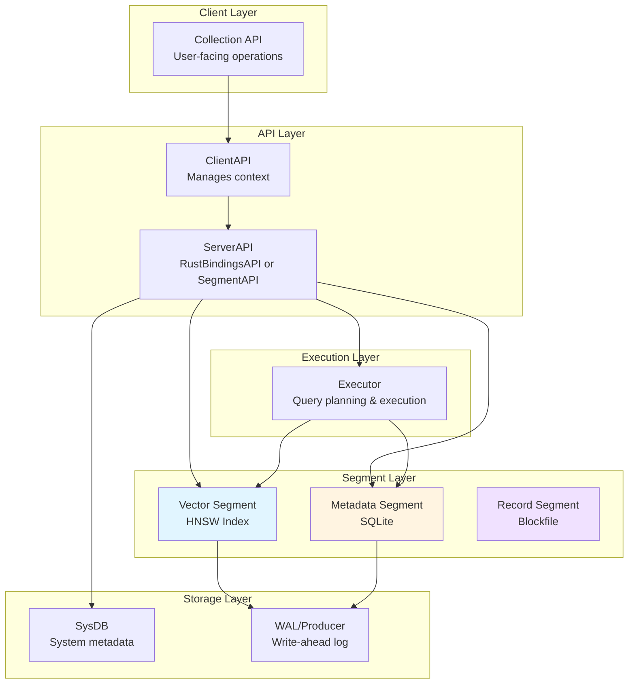
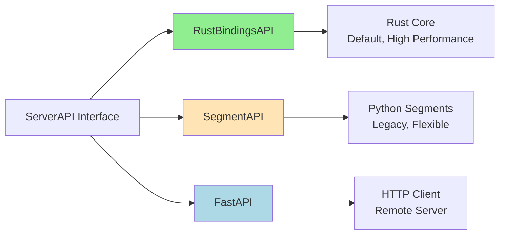
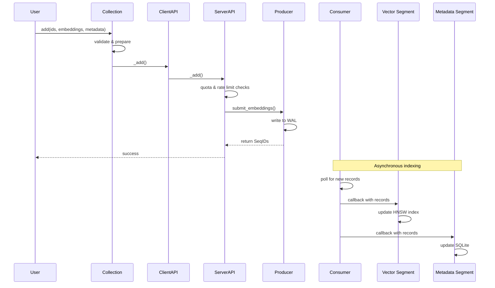

# Part 1: Understanding Chroma - Architecture and Core Concepts

## What You'll Learn

By the end of this post, you'll understand:
- Chroma's layered architecture and the rationale behind it
- The segment abstraction that enables pluggable storage strategies
- How data flows from client operations through to persistent storage
- The relationship between Python and Rust components
- Key design decisions and their trade-offs
- How the dependency injection system ties everything together

## Introduction: Opening the Black Box

When you call `client.add()` on a Chroma collection, what actually happens? Where do your embeddings go? How does querying work? Understanding a vector database requires more than knowing its API—you need to understand its architecture.

Chroma isn't just a vector store. It's a carefully architected system that balances multiple concerns: performance (Rust internals), developer experience (Python API), flexibility (pluggable components), and scalability (distributed mode). Let's explore how all these pieces fit together.

## The Big Picture: Chroma's Layered Architecture

Chroma employs a hybrid architecture that combines several patterns. At its core, it's a **layered architecture** with **segment-based decomposition**, but it also incorporates plugin architecture, event-driven patterns, and dependency injection.



Let's understand each layer by following the journey of data through the system.

## Layer 1: The Client Layer - Your Entry Point

When you create a Chroma client, you're actually creating a facade over a much more complex system. Let's look at the different client creation modes:

```python
# File: chromadb/__init__.py:165-243
# https://github.com/chroma-core/chroma/blob/091f8bd5c553f8267c48664e98fb32215055f58e/chromadb/__init__.py#L165-L243

def EphemeralClient(
    settings: Optional[Settings] = None,
    tenant: str = DEFAULT_TENANT,
    database: str = DEFAULT_DATABASE,
) -> ClientAPI:
    """Creates an in-memory instance of Chroma."""
    if settings is None:
        settings = Settings()
    settings.is_persistent = False
    return ClientCreator(settings=settings, tenant=tenant, database=database)


def PersistentClient(
    path: Union[str, Path] = "./chroma",
    settings: Optional[Settings] = None,
    tenant: str = DEFAULT_TENANT,
    database: str = DEFAULT_DATABASE,
) -> ClientAPI:
    """Creates a persistent instance that saves to disk."""
    if settings is None:
        settings = Settings()
    settings.persist_directory = str(path)
    settings.is_persistent = True
    return ClientCreator(tenant=tenant, database=database, settings=settings)


def RustClient(
    path: Optional[str] = None,
    settings: Optional[Settings] = None,
    tenant: str = DEFAULT_TENANT,
    database: str = DEFAULT_DATABASE,
) -> ClientAPI:
    """Creates an instance backed by Rust internals."""
    if settings is None:
        settings = Settings()
    settings.chroma_api_impl = "chromadb.api.rust.RustBindingsAPI"
    settings.is_persistent = path is not None
    settings.persist_directory = path or ""
    return ClientCreator(tenant=tenant, database=database, settings=settings)
```

These factory functions show Chroma's flexibility. The same API can work with different backend implementations. Notice how they all return `ClientAPI` and use `ClientCreator`—this is our first encounter with Chroma's abstraction strategy.

**Key Insight**: The client layer is a thin facade. The real work happens in the `ServerAPI` that the client wraps. This separation allows the same `Collection` interface to work in embedded mode (Rust/Python in-process) or remote mode (HTTP client to a Chroma server).

## Layer 2: The API Layer - Where Implementations Diverge

The API layer is where we see Chroma's most important abstraction: `ServerAPI`. There are three main implementations:



Let's look at how `RustBindingsAPI` initializes itself:

```python
# File: chromadb/api/rust.py:77-125
# https://github.com/chroma-core/chroma/blob/091f8bd5c553f8267c48664e98fb32215055f58e/chromadb/api/rust.py#L77-L125

class RustBindingsAPI(ServerAPI):
    bindings: chromadb_rust_bindings.Bindings
    hnsw_cache_size: int

    def __init__(self, system: System):
        super().__init__(system)
        self.product_telemetry_client = self.require(ProductTelemetryClient)

        # Calculate how many HNSW indices we can cache based on file handles
        if platform.system() != "Windows":
            max_file_handles = resource.getrlimit(resource.RLIMIT_NOFILE)[0]
        else:
            max_file_handles = ctypes.windll.msvcrt._getmaxstdio()

        # Each HNSW index has 4 data files and 1 metadata file
        self.hnsw_cache_size = max_file_handles // 5

    @override
    def start(self) -> None:
        # Configure SQLite persistence
        if self._system.settings.require("is_persistent"):
            persist_path = self._system.settings.require("persist_directory")
            sqlite_persist_path = persist_path + "/chroma.sqlite3"
        else:
            persist_path = None
            sqlite_persist_path = None

        # Configure migration settings
        hash_type = self._system.settings.require("migrations_hash_algorithm")
        migration_mode = self._system.settings.require("migrations")

        # Create Rust bindings with configuration
        self.bindings = chromadb_rust_bindings.Bindings(
            allow_reset=self._system.settings.require("allow_reset"),
            sqlite_db_config=sqlite_config,
            persist_path=persist_path,
            hnsw_cache_size=self.hnsw_cache_size,
        )
```

**Key Insight**: Notice the file handle calculation. This is a real-world constraint—operating systems limit open file descriptors. Chroma must carefully manage how many HNSW indices it keeps open simultaneously. This kind of operational consideration is baked into the architecture.

The `RustBindingsAPI` acts as an adapter, converting Python types to Rust types and vice versa. This keeps the Python API clean while leveraging Rust's performance for the heavy lifting.

## Layer 3: The Segment Layer - Pluggable Storage

Here's where Chroma's architecture gets really interesting. Instead of monolithic storage, Chroma uses **segments**—independent, specialized storage units for different data types.

```python
# File: chromadb/segment/__init__.py:64-73
# https://github.com/chroma-core/chroma/blob/091f8bd5c553f8267c48664e98fb32215055f58e/chromadb/segment/__init__.py#L64-L73

class SegmentType(Enum):
    SQLITE = "urn:chroma:segment/metadata/sqlite"
    HNSW_LOCAL_MEMORY = "urn:chroma:segment/vector/hnsw-local-memory"
    HNSW_LOCAL_PERSISTED = "urn:chroma:segment/vector/hnsw-local-persisted"
    HNSW_DISTRIBUTED = "urn:chroma:segment/vector/hnsw-distributed"
    BLOCKFILE_RECORD = "urn:chroma:segment/record/blockfile"
    BLOCKFILE_METADATA = "urn:chroma:segment/metadata/blockfile"
```

Why separate segments? Let's think about what each data type needs:

- **Vectors**: Fast approximate nearest neighbor search → HNSW index
- **Metadata**: Complex filtering with AND/OR conditions → SQLite with JSON operators
- **Documents**: Full-text search → Specialized text indexing

By separating these concerns into segments, Chroma can:
1. Optimize each storage type independently
2. Swap implementations without changing the API
3. Scale different data types differently (important for distributed mode)

Here's the segment interface:

```python
# File: chromadb/segment/__init__.py (simplified)
# https://github.com/chroma-core/chroma/blob/091f8bd5c553f8267c48664e98fb32215055f58e/chromadb/segment/__init__.py

class SegmentImplementation(Component):
    """Base class for all segments"""
    @abstractmethod
    def count(self, request_version_context: RequestVersionContext) -> int:
        pass

    @abstractmethod
    def max_seqid(self) -> SeqId:
        pass

    @abstractmethod
    def delete(self) -> None:
        pass


class VectorReader(SegmentImplementation):
    """Interface for vector segments"""
    @abstractmethod
    def get_vectors(
        self,
        request_version_context: RequestVersionContext,
        ids: Optional[Sequence[str]] = None,
    ) -> Sequence[VectorEmbeddingRecord]:
        pass

    @abstractmethod
    def query_vectors(
        self, query: VectorQuery
    ) -> Sequence[Sequence[VectorQueryResult]]:
        pass


class MetadataReader(SegmentImplementation):
    """Interface for metadata segments"""
    @abstractmethod
    def get_metadata(
        self,
        request_version_context: RequestVersionContext,
        where: Optional[Where] = None,
        where_document: Optional[WhereDocument] = None,
        ids: Optional[Sequence[str]] = None,
        limit: Optional[int] = None,
        offset: Optional[int] = None,
    ) -> Sequence[MetadataEmbeddingRecord]:
        pass
```

**Key Insight**: The segment abstraction is a **Strategy pattern** at the architectural level. Different segment implementations can be swapped in based on deployment mode, performance requirements, or feature needs.

## Data Flow: The Write Path

Let's trace what happens when you add embeddings to a collection:



Here's the actual code from the HNSW segment that handles this asynchronous update:

```python
# File: chromadb/segment/impl/vector/local_hnsw.py:88-103
# https://github.com/chroma-core/chroma/blob/091f8bd5c553f8267c48664e98fb32215055f58e/chromadb/segment/impl/vector/local_hnsw.py#L88-L103

class LocalHnswSegment(VectorReader):
    @trace_method("LocalHnswSegment.start", OpenTelemetryGranularity.ALL)
    @override
    def start(self) -> None:
        super().start()
        if self._collection:
            seq_id = self.max_seqid()
            # Subscribe to the log for this collection
            self._subscription = self._consumer.subscribe(
                self._collection,
                self._write_records,  # Callback function
                start=seq_id  # Start from where we left off
            )

    @trace_method("LocalHnswSegment.stop", OpenTelemetryGranularity.ALL)
    @override
    def stop(self) -> None:
        super().stop()
        if self._subscription:
            self._consumer.unsubscribe(self._subscription)
```

**Key Insight**: The write path uses a **Producer-Consumer pattern**. Writes return quickly after appending to the WAL (Write-Ahead Log). Indexing happens asynchronously via callbacks. This provides:
- **Durability**: WAL ensures data isn't lost
- **Performance**: API calls don't wait for expensive indexing
- **Consistency**: SeqIDs provide ordering guarantees

## Data Flow: The Query Path

Querying is more complex because it requires coordinating between segments:

```python
# File: chromadb/execution/executor/local.py (simplified concept)
# https://github.com/chroma-core/chroma/blob/091f8bd5c553f8267c48664e98fb32215055f58e/chromadb/execution/executor/local.py

class LocalExecutor(Executor):
    def knn(self, plan: KNNPlan) -> QueryResult:
        # Step 1: Get top-k candidates from vector segment
        vector_results = self._vector_segment(plan.scan.collection).query_vectors(
            query={
                "vectors": plan.knn.embeddings,
                "k": plan.knn.fetch_k,
                "allowed_ids": None,  # Apply filtering later
            }
        )

        # Step 2: Get metadata for filtering
        # Extract candidate IDs from vector results
        candidate_ids = [result.id for batch in vector_results for result in batch]

        # Step 3: Apply metadata filters
        if plan.filter.where or plan.filter.where_document:
            metadata_records = self._metadata_segment(plan.scan.collection).get_metadata(
                where=plan.filter.where,
                where_document=plan.filter.where_document,
                ids=candidate_ids,  # Only check candidates
            )
            # Filter vector results to only those with matching metadata
            filtered_ids = {record["id"] for record in metadata_records}
            vector_results = filter_to_ids(vector_results, filtered_ids)

        # Step 4: Apply projections (what fields to return)
        return self._apply_projection(vector_results, plan.projection)
```

**Key Insight**: The query path demonstrates **separation of concerns**:
- Vector segment: Find similar vectors (approximate, fast)
- Metadata segment: Apply precise filters (exact, still fast via SQLite)
- Executor: Coordinate and combine results

## The Dependency Injection System: Tying It All Together

You might have noticed `system.require()` and `self.require()` calls. This is Chroma's dependency injection (DI) system in action:

```python
# File: chromadb/config.py:334-396 (simplified)
# https://github.com/chroma-core/chroma/blob/091f8bd5c553f8267c48664e98fb32215055f58e/chromadb/config.py#L334-L396

class Component(ABC):
    """Base class for all Chroma components"""
    def __init__(self, system: System):
        self._system = system
        self._dependencies: Set[Component] = set()

    def require(self, type: Type[T]) -> T:
        """Get or create a component instance"""
        inst = self._system.instance(type)
        self._dependencies.add(inst)
        return inst

    def start(self) -> None:
        """Start this component"""
        pass

    def stop(self) -> None:
        """Stop this component"""
        pass


class System:
    """Dependency injection container"""
    def __init__(self, settings: Settings):
        self._settings = settings
        self._instances: Dict[Type[Component], Component] = {}
        self._running = False

    def instance(self, type: Type[T]) -> T:
        """Get or create a singleton instance of a component"""
        # If type is abstract, look up concrete implementation from settings
        if inspect.isabstract(type):
            fqn = settings.require(_abstract_type_keys[get_fqn(type)])
            type = get_class(fqn, type)

        # Create instance if it doesn't exist
        if type not in self._instances:
            impl = type(self)  # Pass system to constructor
            self._instances[type] = impl
            if self._running:
                impl.start()

        return self._instances[type]
```

This DI system enables several powerful features:

1. **Configuration-driven implementation selection**: Change from `SegmentAPI` to `RustBindingsAPI` via settings
2. **Lazy initialization**: Components are only created when needed
3. **Lifecycle management**: `start()` and `stop()` called in topological order
4. **Testability**: Easy to mock components for testing

Here's how it's used in practice:

```python
# In SegmentAPI (Python implementation)
class SegmentAPI(ServerAPI):
    def __init__(self, system: System):
        super().__init__(system)
        # Declare dependencies - these will be created on-demand
        self._sysdb = self.require(SysDB)
        self._manager = self.require(SegmentManager)
        self._executor = self.require(Executor)
        self._producer = self.require(Producer)
        self._consumer = self.require(Consumer)
```

**Key Insight**: Dependency injection isn't just about testing—it's about architectural flexibility. Chroma can swap entire subsystems (Python segments vs Rust implementation) without changing calling code.

## Python ↔ Rust Interop: Best of Both Worlds

One of Chroma's most interesting architectural decisions is the Python/Rust split. Why not pure Python or pure Rust?

**Python provides**:
- Excellent ecosystem for ML/AI (NumPy, PyTorch, TensorFlow)
- Easy integration with LangChain, LlamaIndex, etc.
- Rapid development and iteration
- Accessible to a wide developer base

**Rust provides**:
- Memory safety without garbage collection
- Fearless concurrency (no GIL!)
- Near-C++ performance for compute-intensive operations
- Excellent tooling (Cargo, type system)

The `RustBindingsAPI` acts as a bridge, using PyO3 to expose Rust functionality to Python:

```python
# Python calls Rust via bindings
rust_result = self.bindings.query(
    collection_id=str(collection_id),
    vectors=query_embeddings,  # List[List[float]]
    k=n_results,
    where=where,  # Converted to JSON
    where_document=where_document,
)

# Convert Rust results back to Python types
return QueryResult(
    ids=rust_result.ids,
    embeddings=deserialize_embeddings(rust_result.embeddings),
    distances=rust_result.distances,
    metadatas=rust_result.metadatas,
    documents=rust_result.documents,
)
```

This hybrid approach means:
- Fast vector operations (Rust HNSW implementation)
- Fast metadata queries (Rust SQLite integration)
- Easy-to-use Python API
- No GIL limitations for concurrent operations

## Key Design Decisions and Trade-offs

Let's examine some critical architectural choices:

### 1. Segment Separation

**Decision**: Split vector, metadata, and document storage into separate segments.

**Trade-offs**:
- ✅ Pro: Optimize each independently
- ✅ Pro: Different scaling strategies per data type
- ✅ Pro: Pluggable implementations
- ❌ Con: Query coordination overhead
- ❌ Con: More complex than monolithic storage

### 2. Asynchronous Indexing

**Decision**: Return from writes before indexing completes.

**Trade-offs**:
- ✅ Pro: Low-latency writes
- ✅ Pro: Batch indexing more efficient
- ✅ Pro: Doesn't block on disk I/O
- ❌ Con: Read-your-writes not guaranteed immediately
- ❌ Con: Need to track SeqIDs for consistency

### 3. Python + Rust

**Decision**: Python API with Rust core.

**Trade-offs**:
- ✅ Pro: Best of both ecosystems
- ✅ Pro: Easy ML ecosystem integration
- ✅ Pro: High performance critical paths
- ❌ Con: FFI boundary overhead
- ❌ Con: Two languages to maintain

## Architecture Evolution: Where Is It Heading?

The architecture we've explored represents Chroma's current state, but it's designed to evolve:

1. **Distributed Mode**: Segments can be distributed across nodes (we'll cover this in Part 7)
2. **New Segment Types**: Block-based storage, compressed segments
3. **Query Optimization**: More sophisticated query planning
4. **Cloud-Native**: Better Kubernetes integration, object storage backends

The layered, segment-based architecture makes these evolutions possible without rewriting the core.

## Key Takeaways

1. **Chroma uses a layered, segment-based architecture** that separates concerns while maintaining flexibility

2. **Segments are the key abstraction** enabling pluggable storage strategies for different data types

3. **The API layer has multiple implementations** (Rust, Python, HTTP) all using the same interface

4. **Data flows through a producer-consumer pattern** for durability and performance

5. **Dependency injection** enables configuration-driven behavior and testability

6. **Python + Rust provides the best of both worlds** for developer experience and performance

7. **Design decisions involve trade-offs** - there's no perfect architecture, only appropriate choices for specific constraints

## Next Steps

Now that you understand the overall architecture, you're ready to dive deeper into specific components:

1. **Explore the codebase**: Clone the repo and trace through a query or write operation
2. **Try different client modes**: Compare EphemeralClient, PersistentClient, and HttpClient
3. **Read the configuration options**: Understand how settings change behavior
4. **Set up debugging**: Add breakpoints and watch data flow through the layers

In **Part 2**, we'll deep-dive into vector storage and the HNSW algorithm, examining how Chroma achieves fast similarity search. We'll look at the actual HNSW implementation, understand its parameters, and explore performance characteristics.

---

**[← Series Outline](00-series-outline.md)** | **[Part 2: Vector Storage and HNSW →](02-deep-dive-vector-storage.md)**

---

*Code examples from Chroma commit [`091f8bd`](https://github.com/chroma-core/chroma/tree/091f8bd5c553f8267c48664e98fb32215055f58e)*
