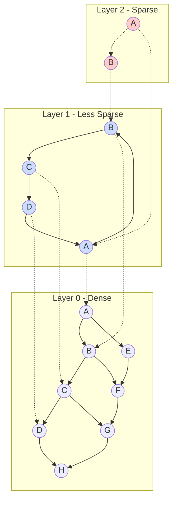
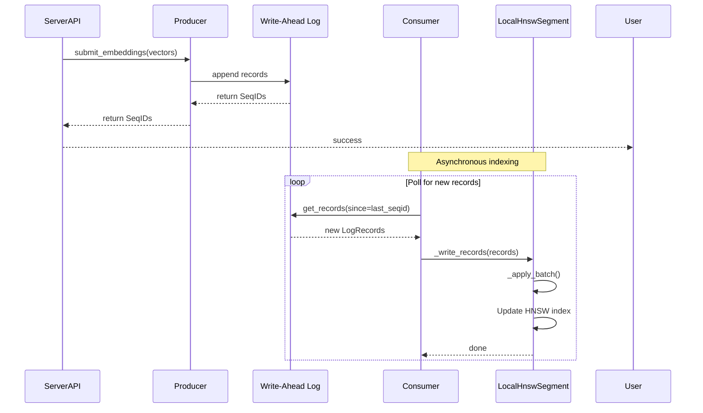

# Part 2: Deep Dive - Vector Storage and HNSW Indexing

## What You'll Learn

By the end of this post, you'll understand:
- How HNSW (Hierarchical Navigable Small World) graphs enable fast similarity search
- The LocalHnswSegment implementation and its complete lifecycle
- How Chroma manages thread safety with read-write locks
- The Producer-Consumer pattern for asynchronous vector indexing
- HNSW parameters and their impact on performance
- Memory management strategies for large vector collections

## Introduction: The Heart of a Vector Database

In Part 1, we explored Chroma's architecture from 30,000 feet. Now we're diving deep into the component that makes Chroma a *vector* database: the HNSW index. This is where approximate nearest neighbor (ANN) search happens, where your query embeddings find their most similar matches among millions of vectors.

Understanding HNSW isn't just academic—it's essential for tuning performance, understanding trade-offs, and debugging issues in production. Let's explore how Chroma implements and optimizes this critical component.

## HNSW Fundamentals: Why Not Just Brute Force?

Before we look at code, let's understand the problem we're solving. Suppose you have 1 million vectors, each with 384 dimensions. You want to find the 10 most similar vectors to your query. The naive approach:

```python
# Brute force approach
def naive_search(query, all_vectors, k=10):
    distances = []
    for i, vector in enumerate(all_vectors):
        distance = euclidean_distance(query, vector)
        distances.append((i, distance))
    distances.sort(key=lambda x: x[1])
    return distances[:k]
```

This requires computing 1 million distances—doable, but slow. For 384-dimensional vectors, that's roughly 384 million floating-point operations per query. As your collection grows, this becomes prohibitively expensive.

**HNSW solves this by creating a hierarchical graph structure** that lets us navigate to approximate nearest neighbors in logarithmic time. It's based on two key ideas:

1. **Small World Networks**: Like "six degrees of separation," most nodes are reachable from any other node in a small number of hops
2. **Hierarchical Structure**: Multiple layers, with fewer nodes at higher levels, enable efficient navigation



**Search strategy**: Start at the top layer, navigate to the region closest to your query, then descend layers and refine. Each layer helps you zoom in on the target region.

## LocalHnswSegment: Chroma's HNSW Implementation

Chroma uses the `hnswlib` library (a battle-tested C++ implementation with Python bindings) wrapped in the `LocalHnswSegment` class. Let's examine the complete implementation:

```python
# File: chromadb/segment/impl/vector/local_hnsw.py:37-79
# https://github.com/chroma-core/chroma/blob/091f8bd5c553f8267c48664e98fb32215055f58e/chromadb/segment/impl/vector/local_hnsw.py#L37-L79

class LocalHnswSegment(VectorReader):
    _id: UUID
    _consumer: Consumer
    _collection: Optional[UUID]
    _subscription: Optional[UUID]
    _settings: Settings
    _params: HnswParams

    _index: Optional[hnswlib.Index]
    _dimensionality: Optional[int]
    _total_elements_added: int
    _max_seq_id: SeqId

    _lock: ReadWriteLock

    _id_to_label: Dict[str, int]
    _label_to_id: Dict[int, str]
    _id_to_seq_id: Dict[str, SeqId]

    _opentelemtry_client: OpenTelemetryClient

    def __init__(self, system: System, segment: Segment):
        self._consumer = system.instance(Consumer)
        self._id = segment["id"]
        self._collection = segment["collection"]
        self._subscription = None
        self._settings = system.settings
        self._params = HnswParams(segment["metadata"] or {})

        self._index = None
        self._dimensionality = None
        self._total_elements_added = 0
        self._max_seq_id = self._consumer.min_seqid()

        self._id_to_seq_id = {}
        self._id_to_label = {}
        self._label_to_id = {}

        self._lock = ReadWriteLock()
        self._opentelemtry_client = system.require(OpenTelemetryClient)
```

**Key observations**:

1. **Lazy Initialization**: The `_index` starts as `None` and is created on first use
2. **Label Mapping**: hnswlib uses integer labels, but Chroma uses string IDs. The `_id_to_label` and `_label_to_id` dictionaries handle this mapping
3. **Sequence Tracking**: `_max_seq_id` tracks which log records have been processed
4. **Thread Safety**: The `ReadWriteLock` ensures safe concurrent access

## HNSW Parameters: Tuning the Index

HNSW behavior is controlled by several parameters. Let's understand each one:

```python
# File: chromadb/segment/impl/vector/hnsw_params.py:46-63
# https://github.com/chroma-core/chroma/blob/091f8bd5c553f8267c48664e98fb32215055f58e/chromadb/segment/impl/vector/hnsw_params.py#L46-L63

class HnswParams(Params):
    space: str              # Distance metric
    construction_ef: int    # Quality of construction
    search_ef: int          # Quality of search
    M: int                  # Number of connections
    num_threads: int        # Parallel search threads
    resize_factor: float    # Index growth factor

    def __init__(self, metadata: Metadata):
        metadata = metadata or {}
        self.space = str(metadata.get("hnsw:space", "l2"))
        self.construction_ef = int(metadata.get("hnsw:construction_ef", 100))
        self.search_ef = int(metadata.get("hnsw:search_ef", 100))
        self.M = int(metadata.get("hnsw:M", 16))
        self.num_threads = int(
            metadata.get("hnsw:num_threads", multiprocessing.cpu_count())
        )
        self.resize_factor = float(metadata.get("hnsw:resize_factor", 1.2))
```

Let's break down what each parameter does:

### Distance Metric (`space`)

- **`l2`** (default): Euclidean distance - standard for most embeddings
- **`cosine`**: Cosine similarity - good for normalized vectors
- **`ip`**: Inner product - for specific use cases like maximum inner product search

**Trade-off**: This choice depends on how your embedding model was trained. Most modern models (OpenAI, Sentence Transformers) use cosine similarity, but vectors are often normalized, making L2 equivalent.

### Construction Parameters

**`M` (number of bi-directional links)**:
- Default: 16
- Higher M → Better recall, more memory, slower construction
- Lower M → Faster construction, less memory, worse recall
- Typical range: 8-64

**`construction_ef`**:
- Default: 100
- Controls the quality of the graph during construction
- Higher → Better graph quality, slower construction
- Lower → Faster construction, potentially worse recall

### Search Parameters

**`search_ef`**:
- Default: 100
- Size of the dynamic candidate list during search
- Higher → Better recall, slower search
- Lower → Faster search, worse recall
- Must be >= k (number of results requested)

**Key Insight**: You can adjust `search_ef` at query time without rebuilding the index! This is your main runtime tuning knob.

## Index Lifecycle: Initialization and Growth

The index is created lazily when first needed:

```python
# File: chromadb/segment/impl/vector/local_hnsw.py:204-220
# https://github.com/chroma-core/chroma/blob/091f8bd5c553f8267c48664e98fb32215055f58e/chromadb/segment/impl/vector/local_hnsw.py#L204-L220

@trace_method("LocalHnswSegment._init_index", OpenTelemetryGranularity.ALL)
def _init_index(self, dimensionality: int) -> None:
    # Create the index with specified distance metric and dimensionality
    index = hnswlib.Index(
        space=self._params.space,
        dim=dimensionality
    )

    # Initialize with capacity for DEFAULT_CAPACITY (1000) vectors
    index.init_index(
        max_elements=DEFAULT_CAPACITY,
        ef_construction=self._params.construction_ef,
        M=self._params.M,
    )

    # Set search parameters
    index.set_ef(self._params.search_ef)
    index.set_num_threads(self._params.num_threads)

    self._index = index
    self._dimensionality = dimensionality
```

As more vectors are added, the index automatically resizes:

```python
# File: chromadb/segment/impl/vector/local_hnsw.py:222-241
# https://github.com/chroma-core/chroma/blob/091f8bd5c553f8267c48664e98fb32215055f58e/chromadb/segment/impl/vector/local_hnsw.py#L222-L241

@trace_method("LocalHnswSegment._ensure_index", OpenTelemetryGranularity.ALL)
def _ensure_index(self, n: int, dim: int) -> None:
    """Create or resize the index as necessary to accommodate N new records"""
    if not self._index:
        self._dimensionality = dim
        self._init_index(dim)
    else:
        # Validate dimensionality matches
        if dim != self._dimensionality:
            raise InvalidDimensionException(
                f"Dimensionality of ({dim}) does not match index "
                f"dimensionality ({self._dimensionality})"
            )

    index = cast(hnswlib.Index, self._index)

    # Resize if necessary
    if (self._total_elements_added + n) > index.get_max_elements():
        new_size = int(
            (self._total_elements_added + n) * self._params.resize_factor
        )
        index.resize_index(max(new_size, DEFAULT_CAPACITY))
```

**Key Insight**: The `resize_factor` (default 1.2) means the index grows by 20% each time it needs more capacity. This amortizes resize costs while not over-allocating memory.

## The Query Path: Fast Similarity Search

Now let's see how queries actually work:

```python
# File: chromadb/segment/impl/vector/local_hnsw.py:132-194
# https://github.com/chroma-core/chroma/blob/091f8bd5c553f8267c48664e98fb32215055f58e/chromadb/segment/impl/vector/local_hnsw.py#L132-L194

@trace_method("LocalHnswSegment.query_vectors", OpenTelemetryGranularity.ALL)
@override
def query_vectors(
    self, query: VectorQuery
) -> Sequence[Sequence[VectorQueryResult]]:
    if self._index is None:
        return [[] for _ in range(len(query["vectors"]))]

    k = query["k"]
    size = len(self._id_to_label)

    # Handle edge case: requesting more results than we have
    if k > size:
        logger.warning(
            f"Number of requested results {k} is greater than "
            f"number of elements in index {size}, updating n_results = {size}"
        )
        k = size

    # Build filter function if IDs are specified
    labels: Set[int] = set()
    ids = query["allowed_ids"]
    if ids is not None:
        labels = {self._id_to_label[id] for id in ids if id in self._id_to_label}
        if len(labels) < k:
            k = len(labels)

    def filter_function(label: int) -> bool:
        return label in labels

    query_vectors = query["vectors"]

    # Perform the actual KNN search with read lock
    with ReadRWLock(self._lock):
        result_labels, distances = self._index.knn_query(
            np.array(query_vectors, dtype=np.float32),
            k=k,
            filter=filter_function if ids else None,
        )

        # Convert results from labels back to IDs
        all_results: List[List[VectorQueryResult]] = []
        for result_i in range(len(result_labels)):
            results: List[VectorQueryResult] = []
            for label, distance in zip(
                result_labels[result_i], distances[result_i]
            ):
                id = self._label_to_id[label]

                # Optionally retrieve embeddings
                if query["include_embeddings"]:
                    embedding = np.array(
                        self._index.get_items([label])[0]
                    )
                else:
                    embedding = None

                results.append(
                    VectorQueryResult(
                        id=id,
                        distance=distance.item(),
                        embedding=embedding,
                    )
                )
            all_results.append(results)

        return all_results
```

**Key observations**:

1. **Read Lock**: Queries use `ReadRWLock`, allowing concurrent reads but blocking during writes
2. **Filter Function**: If specific IDs are requested, a filter function is passed to hnswlib
3. **Embedding Retrieval**: Optional—retrieving embeddings is expensive, only done if requested
4. **Batch Processing**: Multiple query vectors can be processed in one call

## The Write Path: Asynchronous Indexing

Remember from Part 1 that writes are asynchronous. Let's see how vectors actually get indexed:



Here's the callback that processes new records:

```python
# File: chromadb/segment/impl/vector/local_hnsw.py:290-300
# https://github.com/chroma-core/chroma/blob/091f8bd5c553f8267c48664e98fb32215055f58e/chromadb/segment/impl/vector/local_hnsw.py#L290-L300

@trace_method("LocalHnswSegment._write_records", OpenTelemetryGranularity.ALL)
def _write_records(self, records: Sequence[LogRecord]) -> None:
    """Add a batch of embeddings to the index"""
    if not self._running:
        raise RuntimeError("Cannot add embeddings to stopped component")

    # Ensure single-threaded access
    with WriteRWLock(self._lock):
        batch = Batch()

        for record in records:
            # Process each record into a batch
            # (code continues...)
```

And the actual indexing happens in `_apply_batch`:

```python
# File: chromadb/segment/impl/vector/local_hnsw.py:243-288
# https://github.com/chroma-core/chroma/blob/091f8bd5c553f8267c48664e98fb32215055f58e/chromadb/segment/impl/vector/local_hnsw.py#L243-L288

@trace_method("LocalHnswSegment._apply_batch", OpenTelemetryGranularity.ALL)
def _apply_batch(self, batch: Batch) -> None:
    """Apply a batch of changes, as atomically as possible."""
    deleted_ids = batch.get_deleted_ids()
    written_ids = batch.get_written_ids()
    vectors_to_write = batch.get_written_vectors(written_ids)
    labels_to_write = [0] * len(vectors_to_write)

    # Handle deletions
    if len(deleted_ids) > 0:
        index = cast(hnswlib.Index, self._index)
        for i in range(len(deleted_ids)):
            id = deleted_ids[i]
            if id not in self._id_to_label:
                continue
            label = self._id_to_label[id]

            # Mark as deleted in hnswlib
            index.mark_deleted(label)

            # Remove from mappings
            del self._id_to_label[id]
            del self._label_to_id[label]
            del self._id_to_seq_id[id]

    # Handle additions/updates
    if len(written_ids) > 0:
        self._ensure_index(batch.add_count, len(vectors_to_write[0]))

        # Assign labels (reuse existing or create new)
        next_label = self._total_elements_added + 1
        for i in range(len(written_ids)):
            if written_ids[i] not in self._id_to_label:
                labels_to_write[i] = next_label
                next_label += 1
            else:
                labels_to_write[i] = self._id_to_label[written_ids[i]]

        index = cast(hnswlib.Index, self._index)

        # Critical: Update index first
        index.add_items(vectors_to_write, labels_to_write)

        # If that succeeds, update mappings
        for i, id in enumerate(written_ids):
            self._id_to_seq_id[id] = batch.get_record(id)["log_offset"]
            self._id_to_label[id] = labels_to_write[i]
            self._label_to_id[labels_to_write[i]] = id

        # Finally, update total count
        self._total_elements_added += batch.add_count
```

**Key Insight**: Notice the careful ordering in `_apply_batch`:
1. Update the index first
2. If that succeeds, update mappings
3. If that succeeds, update counters

This provides a form of transaction safety—if the index update fails, we haven't corrupted our internal state.

## Thread Safety: Read-Write Locks

The `ReadWriteLock` is crucial for correctness:

```python
# Usage pattern
with ReadRWLock(self._lock):
    # Multiple readers can hold this simultaneously
    result = self._index.knn_query(...)

with WriteRWLock(self._lock):
    # Only one writer, blocks all readers
    self._index.add_items(...)
```

**Trade-offs**:
- ✅ Multiple concurrent queries (good for read-heavy workloads)
- ✅ Safe updates without race conditions
- ❌ Writes block all reads (can cause query latency spikes during indexing)
- ❌ No lock-free algorithms (but hnswlib isn't lock-free either)

## Memory Management: The File Handle Problem

Here's a real-world issue: operating systems limit open file descriptors. When you have many collections, you can't keep all HNSW indices in memory. Chroma addresses this with LRU caching:

```python
# From Part 1, RustBindingsAPI initialization:
# Each HNSW index has 4 data files and 1 metadata file
self.hnsw_cache_size = max_file_handles // 5
```

For persistent HNSW segments, there's additional logic in `LocalSegmentManager` to cache and evict segments based on usage patterns.

**Key Insight**: This is why the persistent HNSW implementation exists separately from the in-memory one—it needs to handle file I/O, caching, and eviction strategies.

## Performance Characteristics

Let's analyze the performance of different operations:

### Query Performance

```
Time complexity: O(log N) average case with HNSW
Actual performance:
- 1M vectors, 384 dim, k=10: ~0.5-2ms per query
- 10M vectors, 384 dim, k=10: ~1-5ms per query
- Factors: search_ef, M, dimensionality, hardware
```

**Tuning for latency**:
- Lower `search_ef` → faster queries, lower recall
- More `num_threads` → faster if parallelizable
- Warm cache → avoid disk I/O

**Tuning for recall**:
- Higher `search_ef` → better recall, slower queries
- Higher `M` → better graph connectivity, better recall

### Index Construction Performance

```
Time complexity: O(N log N * M * construction_ef)
Memory usage: O(N * (M + dim))
Actual performance:
- 1M vectors, 384 dim: ~2-5 minutes to build
- Dominated by: construction_ef, M, dimensionality
```

### Memory Footprint

```
Per vector memory:
- Graph structure: M * 4 bytes per connection (for node pointers)
- Vector data: dim * 4 bytes (float32)
- Total: ~(M * 4 + dim * 4) bytes per vector

Example (384 dim, M=16):
- (16 * 4 + 384 * 4) = 1,600 bytes per vector
- 1M vectors = ~1.6 GB
- 10M vectors = ~16 GB
```

## Comparing Distance Metrics

Here's how the three distance metrics work:

**L2 (Euclidean)**:
```python
distance = sqrt(sum((a[i] - b[i])^2 for i in range(dim)))
```
- Range: [0, ∞)
- Smaller is more similar
- Sensitive to magnitude

**Cosine**:
```python
similarity = dot(a, b) / (norm(a) * norm(b))
distance = 1 - similarity
```
- Range: [0, 2] (distance)
- Only considers direction, not magnitude
- Common for text embeddings

**Inner Product (IP)**:
```python
distance = -dot(a, b)
```
- Range: (-∞, ∞)
- Negative because we want larger dot products
- Used for specific recommendation systems

## Practical Tuning Guide

Based on common scenarios:

**High-throughput scenario (many concurrent queries)**:
```python
collection = client.create_collection(
    name="high_throughput",
    metadata={
        "hnsw:search_ef": 50,    # Lower for speed
        "hnsw:M": 8,              # Lower for less memory
        "hnsw:num_threads": 4,   # Parallelized search
    }
)
```

**High-accuracy scenario (critical queries)**:
```python
collection = client.create_collection(
    name="high_accuracy",
    metadata={
        "hnsw:search_ef": 200,   # Higher for recall
        "hnsw:M": 32,             # More connections
        "hnsw:construction_ef": 200,  # Better graph
    }
)
```

**Balanced scenario (general purpose)**:
```python
collection = client.create_collection(
    name="balanced",
    metadata={
        "hnsw:search_ef": 100,   # Default
        "hnsw:M": 16,             # Default
    }
)
```

## Key Takeaways

1. **HNSW provides O(log N) search** by creating a hierarchical navigable small-world graph

2. **The segment abstraction** wraps hnswlib and provides integration with Chroma's architecture

3. **Asynchronous indexing** via Producer-Consumer pattern provides durability and performance

4. **Thread safety** is achieved with read-write locks, enabling concurrent queries

5. **Parameters matter**: `search_ef`, `M`, and `construction_ef` significantly impact performance and accuracy

6. **Memory management is critical** with file handle limits and LRU caching for persistent indices

7. **Distance metrics** should match your embedding model's training objective

8. **Tuning is a trade-off** between speed, accuracy, and memory usage

## Next Steps

Now that you understand vector storage in depth:

1. **Experiment with parameters**: Create collections with different HNSW settings and measure performance
2. **Profile your queries**: Use OpenTelemetry traces (notice the `@trace_method` decorators) to see where time goes
3. **Test recall**: Create a ground truth dataset and measure how parameters affect recall
4. **Monitor memory**: Watch index sizes as collections grow

In **Part 3**, we'll examine the design patterns and practices that make Chroma maintainable and extensible. We'll look at dependency injection, query planning, expression algebra, and testing strategies.

---

**[← Part 1: Architecture Overview](01-architecture-overview.md)** | **[Part 3: Patterns and Practices →](03-patterns-practices.md)**

---

*Code examples from Chroma commit [`091f8bd`](https://github.com/chroma-core/chroma/tree/091f8bd5c553f8267c48664e98fb32215055f58e)*
