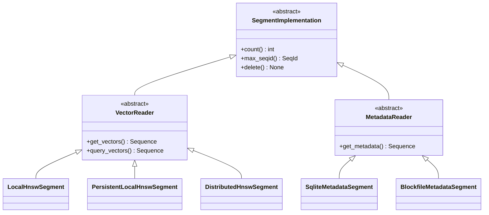

# Part 3: Patterns and Practices in Chroma

## What You'll Learn

By the end of this post, you'll understand:
- How Chroma uses dependency injection for flexibility and testability
- The Strategy pattern in action with pluggable implementations
- Expression algebra for building type-safe queries
- Query planning and execution patterns
- Testing strategies including property-based testing
- Error handling and validation approaches
- Code organization principles

## Introduction: Beyond What, to How

In Parts 1 and 2, we explored *what* Chroma does—its architecture and vector storage. Now we examine *how* it does it—the design patterns, practices, and principles that make the codebase maintainable, testable, and extensible.

Good architecture isn't just about functionality; it's about making the right things easy and the wrong things hard. Chroma demonstrates several patterns worth understanding and applying to your own projects.

## Pattern 1: Dependency Injection - The Foundation

Dependency Injection (DI) is the cornerstone of Chroma's architecture. Let's understand why it matters and how it's implemented.

### The Problem: Tight Coupling

Without DI, components are tightly coupled:

```python
# Anti-pattern: Hard-coded dependencies
class SegmentAPI:
    def __init__(self):
        self.sysdb = SqliteDB("/tmp/chroma")  # Hard-coded!
        self.executor = LocalExecutor()        # Can't swap!
        self.producer = SqliteProducer()       # Fixed implementation!
```

This makes testing difficult, configuration rigid, and swapping implementations impossible.

### Chroma's Solution: Component-Based DI

Here's Chroma's elegant DI implementation:

```python
# File: chromadb/config.py:334-370
# https://github.com/chroma-core/chroma/blob/091f8bd5c553f8267c48664e98fb32215055f58e/chromadb/config.py#L334-L370

class Component(ABC):
    """Base class for all Chroma components."""

    def __init__(self, system: System):
        self._system = system
        self._dependencies: Set[Component] = set()
        self._running = False

    def require(self, type: Type[T]) -> T:
        """Get or create a component instance, registering it as a dependency."""
        inst = self._system.instance(type)
        self._dependencies.add(inst)
        return inst

    def start(self) -> None:
        """Start this component. Override to initialize resources."""
        self._running = True

    def stop(self) -> None:
        """Stop this component. Override to clean up resources."""
        self._running = False

    def reset_state(self) -> None:
        """Reset component state. Used for testing."""
        pass


class System:
    """Dependency injection container and service locator."""

    def __init__(self, settings: Settings):
        self._settings = settings
        self._instances: Dict[Type[Component], Component] = {}
        self._running = False

    def instance(self, type: Type[T]) -> T:
        """Get or create a singleton instance of a component.

        If the type is abstract, looks up the concrete implementation
        from settings and instantiates it.
        """
        # Resolve abstract types to concrete implementations
        if inspect.isabstract(type):
            fqn = self._settings.require(_abstract_type_keys[get_fqn(type)])
            type = get_class(fqn, type)

        # Create instance if it doesn't exist
        if type not in self._instances:
            impl = type(self)  # Pass System to constructor
            self._instances[type] = impl
            if self._running:
                impl.start()

        return self._instances[type]

    def start(self) -> None:
        """Start all components in dependency order."""
        for component in self.components():
            component.start()
        self._running = True

    def components(self) -> Iterable[Component]:
        """Return components in topological (dependency) order."""
        # Build dependency graph
        graph: Dict[Component, Set[Component]] = {}
        for component in self._instances.values():
            graph[component] = component._dependencies

        # Topological sort
        sorter = TopologicalSorter(graph)
        return sorter.static_order()
```

### How It's Used in Practice

Here's how a component declares its dependencies:

```python
# File: chromadb/api/segment.py (simplified)
class SegmentAPI(ServerAPI):
    def __init__(self, system: System):
        super().__init__(system)
        # Declare dependencies - these will be created on-demand
        self._sysdb = self.require(SysDB)
        self._manager = self.require(SegmentManager)
        self._executor = self.require(Executor)
        self._producer = self.require(Producer)
        self._consumer = self.require(Consumer)
```

And here's the magic—abstract types are resolved via configuration:

```python
# File: chromadb/config.py:68-89
# https://github.com/chroma-core/chroma/blob/091f8bd5c553f8267c48664e98fb32215055f58e/chromadb/config.py#L68-L89

_abstract_type_keys: Dict[str, str] = {
    "chromadb.api.ServerAPI": "chroma_api_impl",
    "chromadb.db.system.SysDB": "chroma_sysdb_impl",
    "chromadb.segment.SegmentManager": "chroma_segment_manager_impl",
    "chromadb.execution.executor.abstract.Executor": "chroma_executor_impl",
    "chromadb.ingest.Producer": "chroma_producer_impl",
    "chromadb.ingest.Consumer": "chroma_consumer_impl",
}

# In Settings class:
class Settings(BaseSettings):
    chroma_api_impl: str = "chromadb.api.rust.RustBindingsAPI"
    chroma_sysdb_impl: str = "chromadb.db.impl.sqlite.SqliteDB"
    chroma_segment_manager_impl: str = "chromadb.segment.impl.manager.local.LocalSegmentManager"
    # ... etc
```

**Key Benefits**:

1. **Configuration-driven behavior**: Change implementations without code changes
2. **Testability**: Easy to inject mocks or test doubles
3. **Lifecycle management**: Components started/stopped in dependency order
4. **Lazy initialization**: Components only created when needed
5. **Singleton pattern**: Each component type has one instance per system

### Example: Swapping Implementations

Want to use distributed segments instead of local ones?

```python
settings = Settings(
    chroma_segment_manager_impl="chromadb.segment.impl.manager.distributed.DistributedSegmentManager"
)
client = chromadb.Client(settings=settings)
# Now using distributed implementation!
```

## Pattern 2: Strategy Pattern - Pluggable Segments

The Strategy pattern allows selecting an algorithm at runtime. Chroma uses it extensively for segments:



The beauty is that code using segments doesn't care which implementation it gets:

```python
# Executor doesn't know or care which vector segment it uses
class LocalExecutor:
    def knn(self, plan: KNNPlan) -> QueryResult:
        # Works with ANY VectorReader implementation
        vector_results = self._vector_segment(plan.scan.collection).query_vectors(...)
```

This pattern enables:
- Testing with mock segments
- Gradual migration (Python → Rust segments)
- Different deployment modes (local vs distributed)

## Pattern 3: Expression Algebra - Type-Safe Queries

One of Chroma's most elegant patterns is the expression algebra for building queries. Instead of string-based queries or complex dictionaries, Chroma provides a type-safe DSL (Domain-Specific Language):

```python
# File: chromadb/execution/expression/operator.py:395-445
# https://github.com/chroma-core/chroma/blob/091f8bd5c553f8267c48664e98fb32215055f58e/chromadb/execution/expression/operator.py#L395-L445

class Key:
    """Field proxy for building Where conditions with operator overloading.

    Examples:
        # Using predefined keys
        Key.DOCUMENT.contains("search text")

        # Custom metadata fields
        Key("status") == "active"
        Key("category").is_in(["science", "tech"])

        # Combining conditions
        (Key("status") == "active") & (Key.SCORE > 0.5)
    """

    # Predefined key constants
    ID: "Key"
    DOCUMENT: "Key"
    EMBEDDING: "Key"
    METADATA: "Key"
    SCORE: "Key"

    def __init__(self, name: str):
        self.name = name

    # Comparison operators
    def __eq__(self, value: Any) -> "Where":
        return Eq(self, Val(value))

    def __ne__(self, value: Any) -> "Where":
        return Ne(self, Val(value))

    def __gt__(self, value: Any) -> "Where":
        return Gt(self, Val(value))

    def __ge__(self, value: Any) -> "Where":
        return Gte(self, Val(value))

    def __lt__(self, value: Any) -> "Where":
        return Lt(self, Val(value))

    def __le__(self, value: Any) -> "Where":
        return Lte(self, Val(value))

    # Set operations
    def is_in(self, values: List[Any]) -> "Where":
        return In(self, Val(values))

    def not_in(self, values: List[Any]) -> "Where":
        return Nin(self, Val(values))

    # String operations
    def contains(self, value: str) -> "Where":
        return Contains(self, Val(value))

    def not_contains(self, value: str) -> "Where":
        return NotContains(self, Val(value))

    def regex(self, pattern: str) -> "Where":
        return Regex(self, Val(pattern))
```

### Where Expressions: Algebraic Data Types

The `Where` class hierarchy represents filter conditions as an algebraic data type:

```python
# File: chromadb/execution/expression/operator.py:38-60
# https://github.com/chroma-core/chroma/blob/091f8bd5c553f8267c48664e98fb32215055f58e/chromadb/execution/expression/operator.py#L38-L60

@dataclass
class Where:
    """Base class for Where expressions (algebraic data type).

    Supports logical operators for combining conditions:
        - AND: where1 & where2
        - OR: where1 | where2

    Examples:
        # Simple conditions
        where1 = Key("status") == "active"
        where2 = Key("score") > 0.5

        # Combining with AND
        combined_and = where1 & where2

        # Combining with OR
        combined_or = where1 | where2

        # Complex expressions
        complex_where = (
            (Key("status") == "active") &
            ((Key("score") > 0.5) | (Key("priority") == "high"))
        )
    """

    def __and__(self, other: "Where") -> "Where":
        return And(self, other)

    def __or__(self, other: "Where") -> "Where":
        return Or(self, other)
```

### Why This Matters

Compare these approaches:

```python
# ❌ String-based (error-prone, no type checking)
where = "status = 'active' AND score > 0.5"

# ❌ Dictionary-based (verbose, easy to make mistakes)
where = {
    "$and": [
        {"status": {"$eq": "active"}},
        {"score": {"$gt": 0.5}}
    ]
}

# ✅ Expression-based (type-safe, readable)
where = (Key("status") == "active") & (Key("score") > 0.5)
```

The expression-based approach provides:
- **Type safety**: IDE autocomplete and type checking
- **Composability**: Build complex queries from simple parts
- **Readability**: Natural operator syntax
- **Validation**: Errors caught at construction time, not execution

## Pattern 4: Query Planning - Separation of Concerns

Chroma separates query *specification* from query *execution*. This is the Command pattern applied to database queries.

### Query Plans as Data Structures

```python
# File: chromadb/execution/expression/plan.py:18-37
# https://github.com/chroma-core/chroma/blob/091f8bd5c553f8267c48664e98fb32215055f58e/chromadb/execution/expression/plan.py#L18-L37

@dataclass
class CountPlan:
    scan: Scan


@dataclass
class GetPlan:
    scan: Scan
    filter: Filter = field(default_factory=Filter)
    limit: Limit = field(default_factory=Limit)
    projection: Projection = field(default_factory=Projection)


@dataclass
class KNNPlan:
    scan: Scan
    knn: KNN
    filter: Filter = field(default_factory=Filter)
    projection: Projection = field(default_factory=Projection)
```

These are pure data structures—no logic, just specifications of *what* to execute.

### Executors: The Execution Engine

Executors take plans and execute them:

```python
# Simplified from chromadb/execution/executor/local.py
class LocalExecutor(Executor):
    def knn(self, plan: KNNPlan) -> QueryResult:
        # 1. Execute vector search
        vector_results = self._vector_segment(plan.scan.collection).query_vectors(
            query={
                "vectors": plan.knn.embeddings,
                "k": plan.knn.fetch_k,
                "include_embeddings": plan.projection.embedding,
            }
        )

        # 2. Apply metadata filtering if present
        if plan.filter.where or plan.filter.where_document:
            candidate_ids = self._extract_ids(vector_results)
            metadata_records = self._metadata_segment(plan.scan.collection).get_metadata(
                where=plan.filter.where,
                where_document=plan.filter.where_document,
                ids=candidate_ids,
            )
            # Filter to only matching IDs
            valid_ids = {r["id"] for r in metadata_records}
            vector_results = self._filter_to_ids(vector_results, valid_ids)

        # 3. Apply projections and return
        return self._build_result(vector_results, plan.projection)
```

**Benefits**:
- **Testability**: Plans are data, easy to create in tests
- **Optimization**: Plans can be analyzed and optimized before execution
- **Distribution**: Plans can be serialized and sent to remote executors
- **Debugging**: Plans can be logged/inspected without executing

## Pattern 5: Observer/Pub-Sub - Asynchronous Indexing

We covered this in Part 2, but let's see the pattern clearly:

```python
# Publisher (Producer)
class Producer(Component):
    def submit_embeddings(
        self, collection_id: UUID, embeddings: Sequence[OperationRecord]
    ) -> Sequence[SeqId]:
        """Submit records to the log, return sequence IDs."""
        pass

# Subscriber (Consumer)
class Consumer(Component):
    def subscribe(
        self,
        collection_id: UUID,
        consume_fn: Callable[[Sequence[LogRecord]], None],
        start: Optional[SeqId] = None
    ) -> UUID:
        """Subscribe to updates, calling consume_fn for each batch."""
        pass

# Usage in LocalHnswSegment
def start(self) -> None:
    seq_id = self.max_seqid()
    self._subscription = self._consumer.subscribe(
        self._collection,
        self._write_records,  # Callback
        start=seq_id
    )
```

This decouples:
- Write latency from indexing time
- API layer from segment implementation
- Producer from consumers

## Pattern 6: Property-Based Testing

Chroma uses Hypothesis for property-based testing. Instead of writing individual test cases, you specify *properties* that should always hold:

```python
# File: chromadb/test/property/test_embeddings.py:77-100
# https://github.com/chroma-core/chroma/blob/091f8bd5c553f8267c48664e98fb32215055f58e/chromadb/test/property/test_embeddings.py#L77-L100

@dataclass
class EmbeddingStateMachineStates:
    initialize = "initialize"
    add_embeddings = "add_embeddings"
    delete_by_ids = "delete_by_ids"
    update_embeddings = "update_embeddings"
    upsert_embeddings = "upsert_embeddings"


class EmbeddingStateMachineBase(RuleBasedStateMachine):
    """State machine that tests embedding operations.

    Hypothesis generates random sequences of operations and verifies
    invariants hold after each operation.
    """

    collection: Collection
    embedding_ids: Bundle[ID] = Bundle("embedding_ids")

    @initialize(collection=collection_st)
    def initialize(self, collection: strategies.Collection) -> None:
        """Initialize with a collection."""
        self.collection = self.client.create_collection(
            name=collection.name,
            metadata=collection.metadata,
        )

    @rule(target=embedding_ids, embeddings=strategies.recordsets())
    def add_embeddings(self, embeddings: strategies.RecordSet) -> MultipleResults[ID]:
        """Add embeddings and return their IDs for future operations."""
        self.collection.add(
            ids=embeddings["ids"],
            embeddings=embeddings["embeddings"],
            metadatas=embeddings["metadatas"],
        )
        return multiple(*embeddings["ids"])

    @invariant()
    def count_matches_ids(self) -> None:
        """Invariant: count should match number of unique IDs."""
        count = self.collection.count()
        all_records = self.collection.get()
        assert count == len(all_records["ids"])
```

**Why this approach?**

Traditional testing:
```python
def test_add_then_get():
    collection.add(ids=["1"], embeddings=[[1,2,3]])
    result = collection.get(ids=["1"])
    assert result["ids"] == ["1"]
```

Property-based testing:
```python
@rule(target=embedding_ids, embeddings=strategies.recordsets())
def add_embeddings(self, embeddings):
    # Hypothesis generates thousands of different recordsets
    # Tests arbitrary sequences: add → update → delete → query
    # Finds edge cases you wouldn't think of
```

Hypothesis found real bugs in Chroma by generating unexpected but valid sequences of operations.

## Pattern 7: Validation at Boundaries

Chroma validates data at system boundaries, not deep inside:

```python
# In Collection.add()
def _validate_and_prepare_add_request(
    self,
    ids: OneOrMany[ID],
    embeddings: Optional[OneOrMany[Embedding]] = None,
    metadatas: Optional[OneOrMany[Metadata]] = None,
    documents: Optional[OneOrMany[Document]] = None,
) -> Dict[str, Any]:
    """Validate inputs and prepare request."""

    # Normalize to lists
    ids = maybe_cast_one_to_many(ids)
    embeddings = maybe_cast_one_to_many(embeddings) if embeddings else None
    metadatas = maybe_cast_one_to_many(metadatas) if metadatas else None
    documents = maybe_cast_one_to_many(documents) if documents else None

    # Validate IDs
    if not ids:
        raise ValueError("ids must be non-empty")
    if len(ids) != len(set(ids)):
        raise ValueError("ids must be unique")

    # Validate embeddings or documents provided
    if embeddings is None and documents is None:
        raise ValueError("You must provide either embeddings or documents")

    # Validate lengths match
    if embeddings and len(ids) != len(embeddings):
        raise ValueError("ids and embeddings must have same length")

    # ... more validation

    return {
        "ids": ids,
        "embeddings": prepared_embeddings,
        "metadatas": metadatas,
        "documents": documents,
    }
```

**Principle**: "Parse, don't validate"—transform input into a validated form once, then pass around the validated data.

## Code Organization: Layered by Concern

Chroma's directory structure reflects its architecture:

```
chromadb/
├── api/              # API layer (client, server APIs)
│   ├── client.py     # Client facade
│   ├── segment.py    # Python segment implementation
│   ├── rust.py       # Rust bindings implementation
│   └── fastapi.py    # HTTP client
├── db/               # Storage layer
│   ├── base.py       # Abstract interfaces
│   ├── system.py     # System database (SysDB)
│   └── impl/         # Concrete implementations
├── segment/          # Segment layer
│   ├── __init__.py   # Abstract segment interfaces
│   └── impl/         # Segment implementations
│       ├── vector/   # Vector segments (HNSW)
│       ├── metadata/ # Metadata segments (SQLite)
│       └── manager/  # Segment managers
├── execution/        # Execution layer
│   ├── executor/     # Query executors
│   └── expression/   # Query plans and expressions
├── ingest/           # Write-ahead log
│   └── __init__.py   # Producer/Consumer interfaces
├── config.py         # DI system and settings
└── types.py          # Core type definitions
```

Each directory has:
- Abstract base classes (`__init__.py` or `base.py`)
- Concrete implementations (in `impl/` subdirectories)
- Clear separation between interface and implementation

## Error Handling Patterns

Chroma uses custom exception hierarchy for clear error handling:

```python
# chromadb/errors.py
class ChromaError(Exception):
    """Base exception for all Chroma errors."""

class InvalidDimensionException(ChromaError):
    """Raised when vector dimensionality doesn't match index."""

class IDAlreadyExistsError(ChromaError):
    """Raised when trying to add an ID that already exists."""

class NotFoundError(ChromaError):
    """Raised when a resource is not found."""
```

Usage:
```python
if dim != self._dimensionality:
    raise InvalidDimensionException(
        f"Dimensionality of ({dim}) does not match "
        f"index dimensionality ({self._dimensionality})"
    )
```

**Benefits**:
- Specific exceptions for specific errors
- Easy to catch and handle specific cases
- Clear error messages aid debugging

## Key Takeaways

1. **Dependency Injection** provides configuration-driven behavior, testability, and flexibility

2. **Strategy Pattern** enables pluggable implementations of segments, executors, and storage

3. **Expression Algebra** provides type-safe, composable query building

4. **Query Planning** separates specification from execution for optimization and distribution

5. **Observer/Pub-Sub** decouples writes from indexing for performance and durability

6. **Property-Based Testing** finds edge cases traditional tests miss

7. **Validation at Boundaries** transforms input once and passes validated data

8. **Clear Code Organization** reflects architectural layers and concerns

9. **Custom Exception Hierarchy** provides specific, actionable error information

10. **Patterns Work Together** - DI enables Strategy, expressions enable planning, etc.

## Next Steps

To deepen your understanding:

1. **Trace a query end-to-end**: Set breakpoints and watch how expressions become plans become results
2. **Write a custom segment**: Implement the `VectorReader` interface to understand the contract
3. **Experiment with the expression DSL**: Build complex queries using `Key` and operators
4. **Run property-based tests**: See Hypothesis in action with `pytest chromadb/test/property/`
5. **Study the DI system**: Understand topological sorting for component startup

In **Part 4**, we'll explore how to extend Chroma with custom embedding functions, integrate it with frameworks like LangChain, and use its extension points effectively.

---

**[← Part 2: Vector Storage](02-deep-dive-vector-storage.md)** | **[Part 4: Extending and Integrating →](04-extending-integrating.md)**

---

*Code examples from Chroma commit [`091f8bd`](https://github.com/chroma-core/chroma/tree/091f8bd5c553f8267c48664e98fb32215055f58e)*
