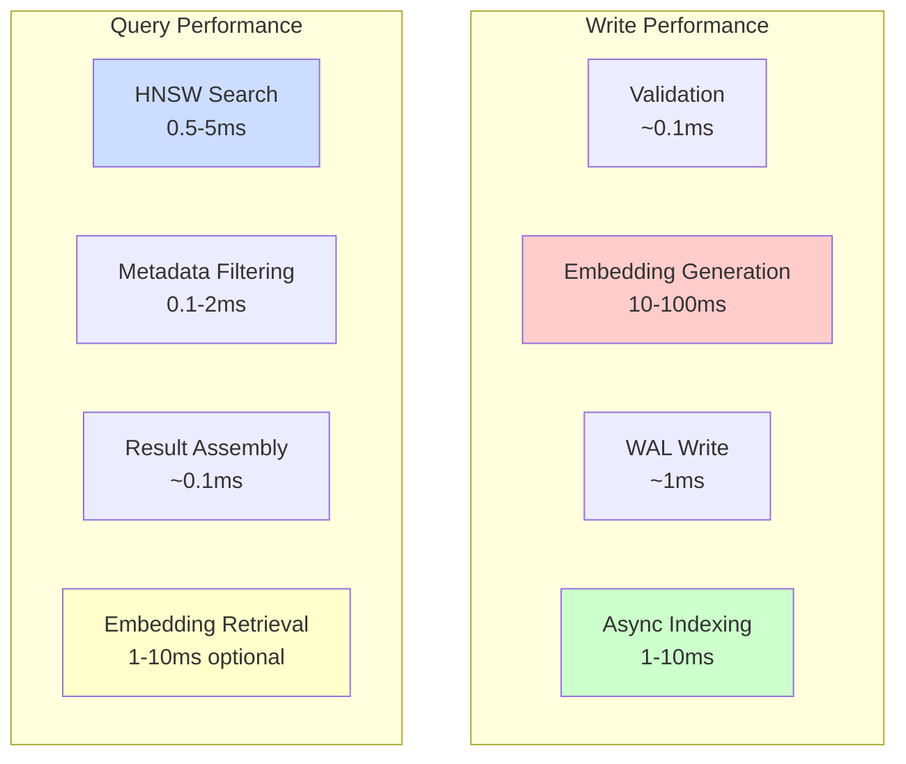

# Part 5: Performance Analysis and Optimization

## What You'll Learn

By the end of this post, you'll understand:
- Performance characteristics of different Chroma operations
- Where bottlenecks occur and why
- Memory management strategies (LRU caching, file handle limits)
- Query optimization techniques
- Write path optimizations (batching, asynchronous indexing)
- Telemetry and observability with OpenTelemetry
- Benchmarking approaches and metrics
- Production optimization strategies

## Introduction: Performance Matters

A vector database is only as good as its performance under load. Understanding Chroma's performance characteristics isn't just about making things fast—it's about making informed trade-offs between latency, throughput, recall, and resource usage.

In this post, we'll analyze Chroma's performance from multiple angles, identify bottlenecks, and explore optimization strategies for real-world workloads.

## Performance Model: What Are We Optimizing?

Before diving into specifics, let's establish what we care about:



**Key Metrics**:
- **Latency**: Time for a single operation (p50, p95, p99)
- **Throughput**: Operations per second
- **Recall**: Quality of search results (% of true nearest neighbors found)
- **Resource Usage**: Memory, CPU, disk I/O, file descriptors

**The Fundamental Trade-off**: You can optimize for any two, but rarely all three of speed, accuracy, and resource efficiency.

## The Write Path: Understanding Latency

Let's break down where time goes when adding embeddings:

### Step 1: Input Validation (~0.1-1ms)

```python
# From Collection.add() and validation logic
# Time: ~0.1-1ms for typical batches
def _validate_and_prepare_add_request(...) -> Dict:
    # Normalize inputs (lists vs single items)
    ids = maybe_cast_one_to_many(ids)  # ~0.01ms

    # Validate uniqueness
    if len(ids) != len(set(ids)):  # ~0.1ms for 1000 ids
        raise ValueError("ids must be unique")

    # Validate lengths match
    if len(ids) != len(embeddings):  # ~0.01ms
        raise ValueError("Length mismatch")

    # Validate metadata types
    for metadata in metadatas:  # ~0.5ms for 1000 items
        validate_metadata(metadata)
```

**Performance tip**: Batch multiple adds together to amortize validation overhead.

### Step 2: Embedding Generation (MOST EXPENSIVE)

This is almost always your bottleneck:

```python
# If documents are provided but not embeddings
if embeddings is None and documents is not None:
    embeddings = self._embedding_function(documents)
    # Time: 10-100ms per document depending on model
    # - Local sentence-transformers: ~20ms per doc
    # - API calls (OpenAI, Cohere): ~50-200ms per doc
    # - Batched: can be much faster (e.g., 100 docs in 500ms)
```

**Performance characteristics**:
- **Local models** (sentence-transformers):
  - Single doc: ~20-50ms
  - Batch of 100: ~500ms-2s (better amortization)
  - GPU acceleration: 5-10x faster

- **API-based models** (OpenAI, Cohere):
  - Single doc: ~50-200ms (network latency)
  - Batch of 100: ~1-3s (API rate limits apply)
  - Concurrent requests: Can improve throughput

**Optimization strategies**:
```python
# ❌ Bad: One at a time
for doc in documents:
    collection.add(documents=[doc], ids=[generate_id()])
    # Total: N * (validation + embedding + write)

# ✅ Good: Batch together
collection.add(
    documents=documents,
    ids=[generate_id() for _ in documents]
)
# Total: validation + batch_embedding + write
# Typically 5-10x faster for large batches
```

### Step 3: WAL Write (~0.5-2ms)

```python
# File: chromadb/ingest/ (Producer implementation)
# Writing to WAL/SQLite queue

def submit_embeddings(
    self, collection_id: UUID, embeddings: Sequence[OperationRecord]
) -> Sequence[SeqId]:
    # Append to write-ahead log
    # Time: ~0.5-2ms for typical batch
    # - Depends on: batch size, disk speed, fsync settings
    with self._db.tx() as cur:
        for record in embeddings:
            # Insert into embeddings_queue table
            cur.execute(
                "INSERT INTO embeddings_queue ...",
                (collection_id, record_data)
            )
        cur.commit()  # fsync to disk
```

**Performance factors**:
- **Disk speed**: SSD vs HDD makes 10-100x difference
- **fsync policy**: Immediate vs batched
- **Batch size**: Larger batches amortize transaction overhead

### Step 4: Asynchronous Indexing (~1-10ms per record)

```python
# File: chromadb/segment/impl/vector/local_hnsw.py
# Consumer callback processes records

def _write_records(self, records: Sequence[LogRecord]) -> None:
    with WriteRWLock(self._lock):  # Acquire write lock
        batch = Batch()
        for record in records:
            batch.apply(record)

        # Apply to HNSW index
        self._apply_batch(batch)
        # Time: ~1-10ms per vector
        # - Depends on: M, ef_construction, current index size
        # - Larger indices take longer (logarithmic)
```

**HNSW indexing time complexity**: O(log N * M * ef_construction)

**Example timings** (384-dim vectors, M=16, ef_construction=100):
- 1,000 vectors: ~1ms per insert
- 10,000 vectors: ~2ms per insert
- 100,000 vectors: ~3ms per insert
- 1,000,000 vectors: ~5ms per insert

**Key insight**: Indexing happens *asynchronously* in the background. The `add()` call returns after step 3, not step 4.

## The Query Path: Optimizing Search

Query performance has several components:

### Component 1: HNSW Vector Search (DOMINANT)

```python
# File: chromadb/segment/impl/vector/local_hnsw.py:132-166
# query_vectors() implementation

with ReadRWLock(self._lock):  # Read lock (concurrent-safe)
    result_labels, distances = self._index.knn_query(
        np.array(query_vectors, dtype=np.float32),
        k=k,
        filter=filter_function if ids else None,
    )
    # Time: 0.5-10ms depending on parameters
```

**Performance factors**:

1. **search_ef** (most important runtime parameter):
   ```
   search_ef = 10:   ~0.3ms, ~80% recall
   search_ef = 50:   ~0.8ms, ~95% recall
   search_ef = 100:  ~1.5ms, ~98% recall
   search_ef = 200:  ~3ms,   ~99.5% recall
   ```

2. **Index size** (logarithmic impact):
   ```
   10K vectors:    ~0.5ms
   100K vectors:   ~1ms
   1M vectors:     ~2ms
   10M vectors:    ~4ms
   ```

3. **Dimensionality** (linear impact on distance computation):
   ```
   128 dim:  baseline
   384 dim:  ~3x slower
   768 dim:  ~6x slower
   1536 dim: ~12x slower
   ```

4. **Number of results (k)**:
   ```
   k=1:    baseline
   k=10:   ~1.2x slower
   k=100:  ~2x slower
   k=1000: ~5x slower
   ```

**Optimization: Tune search_ef at query time**:
```python
# You can adjust search_ef dynamically!
# This doesn't require rebuilding the index

# Fast queries (lower recall)
collection.query(
    query_embeddings=[[0.1, 0.2, ...]],
    n_results=10,
    # Not directly exposed, but set via collection metadata
)

# High-quality queries (higher recall)
# Set during collection creation:
collection = client.create_collection(
    name="high_quality",
    metadata={"hnsw:search_ef": 200}
)
```

### Component 2: Metadata Filtering (~0.1-5ms)

```python
# File: chromadb/segment/impl/metadata/sqlite.py
# get_metadata() with WHERE clause

def get_metadata(
    self,
    where: Optional[Where] = None,
    where_document: Optional[WhereDocument] = None,
    ids: Optional[Sequence[str]] = None,
    ...
) -> Sequence[MetadataEmbeddingRecord]:

    # Build SQL query with PyPika
    # Time: ~0.1-5ms depending on:
    # - Filter complexity
    # - Number of records to scan
    # - Index availability
```

**Performance characteristics**:

**Without indexes**:
```
1K records, simple filter:     ~0.5ms
10K records, simple filter:    ~2ms
100K records, simple filter:   ~15ms  (full scan!)
100K records, complex filter:  ~30ms  (multiple scans!)
```

**With proper indexes** (future optimization):
```
100K records, indexed field:   ~1ms
100K records, complex indexed: ~3ms
```

**Optimization: Filter after HNSW, not before**:
```python
# Chroma's strategy (GOOD):
# 1. Get top-k*fetch_factor candidates from HNSW (~1ms)
# 2. Filter metadata on ONLY those candidates (~0.1ms)
# 3. Take top-k from filtered results

# Anti-pattern (BAD):
# 1. Filter ALL records by metadata (~15ms for 100K)
# 2. Build HNSW index of filtered subset
# 3. Query that subset
```

### Component 3: Result Assembly (~0.1-1ms)

```python
# Building the final QueryResult
# Time: ~0.1-1ms depending on projection

# Fast: Just IDs and distances
result = QueryResult(
    ids=[...],         # Already have these
    distances=[...],   # Already have these
)

# Slower: Include metadata (requires lookups)
result = QueryResult(
    ids=[...],
    distances=[...],
    metadatas=[...],   # +0.2ms for 10 results
)

# Slowest: Include embeddings (requires vector retrieval)
result = QueryResult(
    ids=[...],
    distances=[...],
    embeddings=[...],  # +1-5ms for 10 results (disk I/O!)
)
```

**Optimization: Only request what you need**:
```python
# ❌ Default includes everything
results = collection.query(
    query_embeddings=[[...]],
    n_results=10,
)

# ✅ Specify exactly what you need
results = collection.query(
    query_embeddings=[[...]],
    n_results=10,
    include=["documents", "metadatas", "distances"]
    # Exclude embeddings if you don't need them!
)
```

## Memory Management: The File Handle Problem

Operating systems limit open file descriptors. This becomes critical with many collections:

```python
# File: chromadb/api/rust.py:77-90
# https://github.com/chroma-core/chroma/blob/091f8bd5c553f8267c48664e98fb32215055f58e/chromadb/api/rust.py#L77-L90

def __init__(self, system: System):
    # Get OS file handle limit
    if platform.system() != "Windows":
        max_file_handles = resource.getrlimit(resource.RLIMIT_NOFILE)[0]
    else:
        max_file_handles = ctypes.windll.msvcrt._getmaxstdio()

    # Each HNSW index uses:
    # - 4 data files (links, data, metadata, etc.)
    # - 1 metadata file
    # = 5 file handles per index
    self.hnsw_cache_size = max_file_handles // 5
```

**Typical limits**:
- macOS: 256-10,240 file handles → ~50-2000 collections
- Linux: 1,024-65,536 file handles → ~200-13,000 collections
- Can be increased via `ulimit -n` or system configuration

**Solution: LRU Cache for Vector Segments**

```python
# Simplified from chromadb/segment/impl/manager/local.py
class SegmentLRUCache:
    """Least Recently Used cache for vector segments."""

    def __init__(self, capacity: int):
        self._capacity = capacity
        self._cache: Dict[UUID, VectorSegment] = {}
        self._lru_order: List[UUID] = []

    def get(self, segment_id: UUID) -> VectorSegment:
        if segment_id in self._cache:
            # Move to end (most recently used)
            self._lru_order.remove(segment_id)
            self._lru_order.append(segment_id)
            return self._cache[segment_id]

        # Not in cache - load and evict if necessary
        segment = self._load_segment(segment_id)

        if len(self._cache) >= self._capacity:
            # Evict least recently used
            lru_id = self._lru_order.pop(0)
            evicted = self._cache.pop(lru_id)
            evicted.stop()  # Close file handles

        self._cache[segment_id] = segment
        self._lru_order.append(segment_id)
        return segment
```

**Performance implications**:
- **Cache hit**: ~0ms overhead
- **Cache miss**: ~10-50ms to load HNSW index from disk
- **Cold start**: First query on a collection always misses cache

**Optimization: Pre-warm frequently used collections**:
```python
# After server startup, query main collections to warm cache
for collection_name in ["main", "products", "documents"]:
    collection = client.get_collection(collection_name)
    collection.query(query_embeddings=[[0.0] * 384], n_results=1)
    # Forces index to load into cache
```

## Batching: The Key to Throughput

Batching operations is crucial for high throughput:

### Write Batching

```python
# ❌ Bad: One at a time (N round trips)
for i in range(1000):
    collection.add(
        ids=[f"id_{i}"],
        documents=[documents[i]],
        metadatas=[metadatas[i]]
    )
# Time: ~1000 * 25ms = 25 seconds

# ✅ Good: Batch together (1 round trip)
collection.add(
    ids=[f"id_{i}" for i in range(1000)],
    documents=documents[:1000],
    metadatas=metadatas[:1000]
)
# Time: ~2 seconds (10x faster!)
```

**Optimal batch sizes**:
- **Embedding generation**: 50-200 documents (balances memory and speed)
- **Database writes**: 100-1000 records (transaction overhead)
- **API limits**: Check your embedding provider's batch limits

### Query Batching

```python
# ❌ Sequential queries
results = []
for query in queries:
    result = collection.query(query_embeddings=[query], n_results=10)
    results.append(result)
# Time: N * query_time

# ✅ Batch queries
results = collection.query(
    query_embeddings=queries,  # List of query vectors
    n_results=10
)
# Time: slightly more than 1 * query_time
# HNSW can process multiple queries efficiently
```

## Observability: OpenTelemetry Integration

Chroma includes OpenTelemetry tracing:

```python
# File: chromadb/segment/impl/vector/local_hnsw.py
# Notice the @trace_method decorators

@trace_method("LocalHnswSegment.query_vectors", OpenTelemetryGranularity.ALL)
@override
def query_vectors(self, query: VectorQuery) -> Sequence[Sequence[VectorQueryResult]]:
    # Automatically traced with timing information
    ...

@trace_method("LocalHnswSegment._apply_batch", OpenTelemetryGranularity.ALL)
def _apply_batch(self, batch: Batch) -> None:
    # Track indexing performance
    ...
```

**Enable tracing** (example with Jaeger):
```python
from chromadb.config import Settings
import chromadb

settings = Settings(
    chroma_otel_collection_endpoint="http://localhost:14268/api/traces",
    chroma_otel_service_name="chroma-service",
    chroma_otel_collection_headers={},
    chroma_otel_granularity="all",  # or "operation" for less detail
)

client = chromadb.Client(settings=settings)
# Now all operations are traced!
```

**What you can observe**:
- Time spent in each operation (add, query, update, delete)
- HNSW search time vs metadata filtering time
- Cache hit/miss rates
- Indexing throughput
- Queue depths

## Benchmarking: Measuring What Matters

### Micro-benchmarks: Individual Operations

```python
import time
import numpy as np
import chromadb

client = chromadb.Client()
collection = client.create_collection("benchmark")

# Benchmark: Add performance
def benchmark_add(n=1000, dim=384):
    embeddings = np.random.rand(n, dim).astype(np.float32).tolist()
    ids = [f"id_{i}" for i in range(n)]

    start = time.time()
    collection.add(ids=ids, embeddings=embeddings)
    elapsed = time.time() - start

    print(f"Added {n} vectors in {elapsed:.2f}s")
    print(f"Throughput: {n/elapsed:.0f} vectors/sec")

# Benchmark: Query performance at different search_ef
def benchmark_query(n_queries=100, k=10):
    query = np.random.rand(384).astype(np.float32).tolist()

    start = time.time()
    for _ in range(n_queries):
        collection.query(query_embeddings=[query], n_results=k)
    elapsed = time.time() - start

    print(f"Executed {n_queries} queries in {elapsed:.2f}s")
    print(f"Latency: {elapsed/n_queries*1000:.1f}ms per query")
    print(f"QPS: {n_queries/elapsed:.0f}")
```

### Macro-benchmarks: Real Workloads

```python
# Simulate realistic workload
def benchmark_mixed_workload(
    write_ratio=0.1,   # 10% writes, 90% reads
    duration_sec=60
):
    start = time.time()
    operations = {"add": 0, "query": 0}

    while time.time() - start < duration_sec:
        if random.random() < write_ratio:
            # Write operation
            collection.add(
                ids=[f"id_{random.randint(0, 1000000)}"],
                embeddings=[np.random.rand(384).tolist()]
            )
            operations["add"] += 1
        else:
            # Read operation
            collection.query(
                query_embeddings=[np.random.rand(384).tolist()],
                n_results=10
            )
            operations["query"] += 1

    elapsed = time.time() - start
    total_ops = sum(operations.values())

    print(f"Mixed workload: {total_ops} ops in {elapsed:.0f}s")
    print(f"Throughput: {total_ops/elapsed:.0f} ops/sec")
    print(f"Writes: {operations['add']/elapsed:.0f}/sec")
    print(f"Queries: {operations['query']/elapsed:.0f}/sec")
```

## Production Optimization Strategies

### 1. Tune HNSW Parameters for Your Workload

```python
# High-throughput scenario (many concurrent queries, moderate recall)
collection = client.create_collection(
    name="high_throughput",
    metadata={
        "hnsw:M": 8,              # Lower M = less memory, faster
        "hnsw:search_ef": 50,     # Lower = faster queries
        "hnsw:construction_ef": 100,
    }
)

# High-accuracy scenario (critical queries, lower QPS)
collection = client.create_collection(
    name="high_accuracy",
    metadata={
        "hnsw:M": 32,             # More connections = better recall
        "hnsw:search_ef": 200,    # Higher = better accuracy
        "hnsw:construction_ef": 200,
    }
)
```

### 2. Use Appropriate Distance Metrics

```python
# For normalized embeddings, cosine and L2 give same ranking
# But IP (inner product) is fastest:

collection = client.create_collection(
    name="optimized",
    metadata={"hnsw:space": "ip"}  # Fastest
)

# Make sure your embeddings are normalized!
embeddings_normalized = embeddings / np.linalg.norm(embeddings, axis=1, keepdims=True)
```

### 3. Partition Large Collections

```python
# Instead of one 10M vector collection:
collection = client.get_collection("huge_collection")  # Slow!

# Partition by category/date/etc:
tech_collection = client.get_collection("tech_docs")
science_collection = client.get_collection("science_docs")
# Query only relevant partition(s)
```

### 4. Async Processing for Writes

```python
import asyncio
from concurrent.futures import ThreadPoolExecutor

# Process embeddings concurrently
def add_batch_concurrent(documents, batch_size=100):
    with ThreadPoolExecutor(max_workers=4) as executor:
        futures = []
        for i in range(0, len(documents), batch_size):
            batch = documents[i:i+batch_size]
            future = executor.submit(
                collection.add,
                documents=batch,
                ids=[f"id_{i+j}" for j in range(len(batch))]
            )
            futures.append(future)

        # Wait for all to complete
        for future in futures:
            future.result()
```

## Key Takeaways

1. **Embedding generation dominates write latency** - Optimize this first (use batching, GPU acceleration)

2. **HNSW search is logarithmic** - Performance degrades slowly as index grows

3. **search_ef is your main tuning knob** - Adjust for speed/accuracy trade-off

4. **Batching is crucial** - 5-10x speedup for writes, 2-3x for queries

5. **File handle limits matter** - Plan for caching with many collections

6. **Metadata filtering is efficient** - Done on HNSW candidates, not full dataset

7. **Projections affect performance** - Don't retrieve embeddings unless needed

8. **OpenTelemetry provides visibility** - Use it to identify actual bottlenecks

9. **Benchmark your specific workload** - Synthetic benchmarks don't capture real patterns

10. **Production optimization is workload-specific** - Tune parameters based on your read/write mix and accuracy requirements

## Next Steps

To optimize your Chroma deployment:

1. **Profile your application** - Enable OpenTelemetry and identify bottlenecks
2. **Benchmark with realistic data** - Use your actual vectors and query patterns
3. **Experiment with HNSW parameters** - Find the sweet spot for your use case
4. **Monitor in production** - Track latency, throughput, and resource usage
5. **Load test before deploying** - Understand limits and failure modes

In **Part 6**, we'll cover deployment and operations—how to run Chroma reliably in production with proper monitoring, backup strategies, and operational best practices.

---

**[← Part 4: Extending and Integrating](04-extending-integrating.md)** | **[Part 6: Deployment and Operations →](06-deployment-operations.md)**

---

*Code examples from Chroma commit [`091f8bd`](https://github.com/chroma-core/chroma/tree/091f8bd5c553f8267c48664e98fb32215055f58e)*
