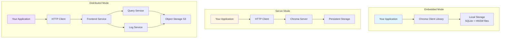

# Part 6: Deployment and Operations Guide

## What You'll Learn

By the end of this post, you'll understand:
- Different deployment modes (embedded, server, distributed)
- When to use each deployment mode
- Setting up Chroma server with Docker and Kubernetes
- Configuration options and environment variables
- Monitoring, logging, and debugging strategies
- Backup and recovery approaches
- Authentication and authorization
- Production best practices and common pitfalls

## Introduction: From Development to Production

So far, we've explored Chroma's internals—architecture, storage, patterns, and performance. Now it's time to run it in production. The good news: Chroma is designed to scale from laptop development to distributed cloud deployment.

In this post, we'll cover the operational journey from local development through production deployment, with practical examples and battle-tested best practices.

## Deployment Modes: Choosing Your Architecture

Chroma supports three primary deployment modes, each suited for different use cases:



### Mode 1: Embedded (Development & Single-Process Apps)

**Use when:**
- Local development and testing
- Single-process applications
- Serverless functions (with ephemeral or mounted storage)
- Simple deployments where you control the process

**Advantages:**
- Zero infrastructure overhead
- No network latency
- Simple deployment (just your app)
- Perfect for prototyping

**Limitations:**
- No multi-process access (one process per database)
- Limited to single-machine scale
- Resource sharing with your application

**Example:**

```python
import chromadb

# Ephemeral (in-memory, lost on restart)
client = chromadb.EphemeralClient()

# Persistent (saved to disk)
client = chromadb.PersistentClient(path="./chroma_data")

# Rust-backed (default, fastest)
client = chromadb.RustClient(path="./chroma_data")

collection = client.create_collection("my_collection")
collection.add(documents=["Hello world"], ids=["1"])
```

**File structure** (PersistentClient):
```
./chroma_data/
├── chroma.sqlite3           # System metadata
└── [collection_id]/         # Per-collection data
    ├── index.bin            # HNSW index
    ├── header.bin           # Index metadata
    ├── data_level0.bin      # Vector data
    └── ...
```

### Mode 2: Server (Production Single-Node)

**Use when:**
- Multiple applications access the same collections
- Running in Docker/Kubernetes
- Need centralized management
- Resource isolation from applications

**Advantages:**
- Multi-client access
- Centralized data and configuration
- Independent scaling
- Clear separation of concerns

**Limitations:**
- Single-node scale (vertical scaling only)
- Network latency overhead
- Additional operational complexity

**Docker Compose Example:**

```yaml
# docker-compose.yml
version: '3.9'

services:
  chroma:
    image: ghcr.io/chroma-core/chroma:latest
    volumes:
      - ./chroma_data:/chroma/chroma
      - ./chroma.env:/chroma/.env
    environment:
      - IS_PERSISTENT=TRUE
      - PERSIST_DIRECTORY=/chroma/chroma
      - ANONYMIZED_TELEMETRY=${ANONYMIZED_TELEMETRY:-TRUE}
      - ALLOW_RESET=FALSE
    ports:
      - "8000:8000"
    networks:
      - chroma-network
    restart: unless-stopped
    healthcheck:
      test: ["CMD", "curl", "-f", "http://localhost:8000/api/v1/heartbeat"]
      interval: 30s
      timeout: 10s
      retries: 3

networks:
  chroma-network:
    driver: bridge

volumes:
  chroma_data:
    driver: local
```

**Environment file** (chroma.env):
```bash
# chroma.env
IS_PERSISTENT=TRUE
PERSIST_DIRECTORY=/chroma/chroma
ANONYMIZED_TELEMETRY=TRUE
ALLOW_RESET=FALSE

# Performance tuning
CHROMA_SERVER_THREAD_POOL_SIZE=40
CHROMA_SEGMENT_CACHE_POLICY=lru

# Authentication (optional)
# CHROMA_SERVER_AUTHN_PROVIDER=chromadb.auth.token_authn.TokenAuthenticationServerProvider
# CHROMA_SERVER_AUTHN_CREDENTIALS_FILE=/chroma/auth_credentials.yaml

# Observability
# CHROMA_OTEL_COLLECTION_ENDPOINT=http://jaeger:14268/api/traces
# CHROMA_OTEL_SERVICE_NAME=chroma-server
```

**Client connection:**

```python
import chromadb

client = chromadb.HttpClient(
    host="localhost",
    port=8000,
    settings=chromadb.Settings(
        chroma_client_auth_provider="chromadb.auth.token_authn.TokenAuthClientProvider",
        chroma_client_auth_credentials="your-token-here"
    )
)

# Use normally
collection = client.get_or_create_collection("my_collection")
```

### Mode 3: Distributed (Production Multi-Node)

**Use when:**
- Large-scale deployments (millions/billions of vectors)
- High availability requirements
- Independent service scaling
- Geographic distribution

**Advantages:**
- Horizontal scaling
- High availability
- Component-level scaling
- Enterprise features

**Limitations:**
- Complex operations
- Higher infrastructure costs
- Distributed system challenges (consistency, debugging)

We'll cover this in detail in Part 7.

## Kubernetes Deployment

For production server mode, Kubernetes provides orchestration, health checking, and scaling:

```yaml
# chroma-deployment.yaml
apiVersion: apps/v1
kind: Deployment
metadata:
  name: chroma
  labels:
    app: chroma
spec:
  replicas: 2  # For high availability
  selector:
    matchLabels:
      app: chroma
  template:
    metadata:
      labels:
        app: chroma
    spec:
      containers:
      - name: chroma
        image: ghcr.io/chroma-core/chroma:latest
        ports:
        - containerPort: 8000
          name: http
        env:
        - name: IS_PERSISTENT
          value: "TRUE"
        - name: PERSIST_DIRECTORY
          value: "/chroma-data"
        - name: ANONYMIZED_TELEMETRY
          value: "FALSE"
        - name: ALLOW_RESET
          value: "FALSE"
        volumeMounts:
        - name: chroma-data
          mountPath: /chroma-data
        resources:
          requests:
            memory: "2Gi"
            cpu: "1000m"
          limits:
            memory: "4Gi"
            cpu: "2000m"
        livenessProbe:
          httpGet:
            path: /api/v1/heartbeat
            port: 8000
          initialDelaySeconds: 30
          periodSeconds: 10
        readinessProbe:
          httpGet:
            path: /api/v1/heartbeat
            port: 8000
          initialDelaySeconds: 5
          periodSeconds: 5
      volumes:
      - name: chroma-data
        persistentVolumeClaim:
          claimName: chroma-pvc

---
apiVersion: v1
kind: Service
metadata:
  name: chroma
spec:
  type: ClusterIP
  ports:
  - port: 8000
    targetPort: 8000
    protocol: TCP
    name: http
  selector:
    app: chroma

---
apiVersion: v1
kind: PersistentVolumeClaim
metadata:
  name: chroma-pvc
spec:
  accessModes:
    - ReadWriteOnce
  resources:
    requests:
      storage: 100Gi
  storageClassName: fast-ssd  # Use appropriate storage class
```

**Deploy:**

```bash
kubectl apply -f chroma-deployment.yaml

# Check status
kubectl get pods -l app=chroma
kubectl logs -f deployment/chroma

# Port forward for local access
kubectl port-forward service/chroma 8000:8000
```

## Configuration: Environment Variables

Chroma is configured via environment variables. Here are the key ones:

### Core Settings

```bash
# Storage
IS_PERSISTENT=TRUE                          # Enable persistence
PERSIST_DIRECTORY=/path/to/data            # Data directory

# API Implementation
CHROMA_API_IMPL=chromadb.api.rust.RustBindingsAPI  # Default, fastest

# Server Settings
CHROMA_SERVER_HOST=0.0.0.0                 # Bind address
CHROMA_SERVER_HTTP_PORT=8000                # HTTP port
CHROMA_SERVER_THREAD_POOL_SIZE=40          # Thread pool for sync operations
CHROMA_SERVER_CORS_ALLOW_ORIGINS=["*"]     # CORS origins (JSON array)

# Performance
CHROMA_SEGMENT_CACHE_POLICY=lru            # Segment caching strategy
CHROMA_MEMORY_LIMIT_BYTES=0                # Memory limit (0 = unlimited)

# Safety
ALLOW_RESET=FALSE                           # Disable dangerous reset API
```

### Authentication Settings

```bash
# Token-based authentication
CHROMA_SERVER_AUTHN_PROVIDER=chromadb.auth.token_authn.TokenAuthenticationServerProvider
CHROMA_SERVER_AUTHN_CREDENTIALS_FILE=/path/to/credentials.yaml

# Example credentials.yaml:
# credentials:
#   - token: "admin-token-secret"
#   - token: "user-token-secret"
```

### Observability Settings

```bash
# OpenTelemetry tracing
CHROMA_OTEL_COLLECTION_ENDPOINT=http://jaeger:14268/api/traces
CHROMA_OTEL_SERVICE_NAME=chroma-server
CHROMA_OTEL_GRANULARITY=all                # or "operation"

# Telemetry (anonymized product analytics)
ANONYMIZED_TELEMETRY=TRUE                   # Disable for air-gapped deployments
```

### Database Settings

```bash
# Migration settings
MIGRATIONS=apply                            # "apply" or "validate"
MIGRATIONS_HASH_ALGORITHM=sha256           # "sha256" or "md5"
```

## Monitoring and Observability

### Health Checks

```bash
# Basic health check
curl http://localhost:8000/api/v1/heartbeat
# Returns: {"nanosecond heartbeat": 1234567890}

# Version info
curl http://localhost:8000/api/v1/version
# Returns version string

# Pre-flight check (for distributed mode)
curl http://localhost:8000/api/v1/pre-flight-checks
```

### Metrics Collection

Chroma emits OpenTelemetry traces. Set up a collector:

```yaml
# otel-collector-config.yaml
receivers:
  otlp:
    protocols:
      http:
        endpoint: 0.0.0.0:4318

processors:
  batch:
    timeout: 10s

exporters:
  prometheus:
    endpoint: "0.0.0.0:8889"
  jaeger:
    endpoint: jaeger:14250
    tls:
      insecure: true

service:
  pipelines:
    traces:
      receivers: [otlp]
      processors: [batch]
      exporters: [jaeger]
    metrics:
      receivers: [otlp]
      processors: [batch]
      exporters: [prometheus]
```

### Logging

```python
# Configure Python logging
import logging

logging.basicConfig(
    level=logging.INFO,
    format='%(asctime)s - %(name)s - %(levelname)s - %(message)s'
)

# Chroma-specific loggers
logging.getLogger("chromadb").setLevel(logging.DEBUG)
logging.getLogger("hnswlib").setLevel(logging.WARNING)
```

**In production**, use structured logging:

```python
import structlog

structlog.configure(
    processors=[
        structlog.processors.TimeStamper(fmt="iso"),
        structlog.processors.JSONRenderer()
    ]
)

logger = structlog.get_logger()
logger.info("query_executed", collection="my_collection", latency_ms=1.5)
```

## Backup and Recovery

### Embedded Mode Backups

```bash
# Simple file-based backup
rsync -av --exclude='*.lock' ./chroma_data /backup/location/

# Or use tar
tar -czf chroma-backup-$(date +%Y%m%d).tar.gz ./chroma_data/

# Restore
tar -xzf chroma-backup-20250117.tar.gz -C ./
```

### Server Mode Backups

```bash
# 1. Stop writes (put in read-only mode if possible)
# 2. Snapshot the data volume

# For Docker volume:
docker run --rm \
  --volumes-from chroma \
  -v $(pwd)/backup:/backup \
  ubuntu tar -czf /backup/chroma-$(date +%Y%m%d).tar.gz /chroma/chroma

# 3. Resume writes

# Restore:
docker run --rm \
  -v chroma_data:/chroma/chroma \
  -v $(pwd)/backup:/backup \
  ubuntu tar -xzf /backup/chroma-20250117.tar.gz -C /
```

### Kubernetes Backups (with Velero)

```yaml
# velero-backup.yaml
apiVersion: velero.io/v1
kind: Schedule
metadata:
  name: chroma-backup
spec:
  schedule: "0 2 * * *"  # Daily at 2 AM
  template:
    includedNamespaces:
    - chroma
    includedResources:
    - persistentvolumeclaims
    - persistentvolumes
    storageLocation: default
    volumeSnapshotLocations:
    - default
```

### Point-in-Time Recovery

For critical deployments, use:
1. **Continuous replication** to secondary storage
2. **WAL archiving** (preserve write-ahead logs)
3. **Snapshot scheduling** (e.g., hourly, daily, weekly retention)

## Security Best Practices

### 1. Authentication

```python
# Server-side: Enable token auth
# Set in environment or config:
# CHROMA_SERVER_AUTHN_PROVIDER=chromadb.auth.token_authn.TokenAuthenticationServerProvider

# Client-side: Provide token
from chromadb.config import Settings

client = chromadb.HttpClient(
    host="chroma.example.com",
    port=8000,
    settings=Settings(
        chroma_client_auth_provider="chromadb.auth.token_authn.TokenAuthClientProvider",
        chroma_client_auth_credentials="your-secure-token-here"
    )
)
```

### 2. Network Security

```yaml
# Use network policies in Kubernetes
apiVersion: networking.k8s.io/v1
kind: NetworkPolicy
metadata:
  name: chroma-network-policy
spec:
  podSelector:
    matchLabels:
      app: chroma
  policyTypes:
  - Ingress
  ingress:
  - from:
    - podSelector:
        matchLabels:
          app: my-application
    ports:
    - protocol: TCP
      port: 8000
```

### 3. TLS/SSL

```python
# Use TLS for production
client = chromadb.HttpClient(
    host="chroma.example.com",
    port=443,
    ssl=True,
    settings=Settings(
        chroma_server_ssl_verify="/path/to/ca-bundle.crt"
    )
)
```

### 4. Resource Limits

```yaml
# Always set resource limits
resources:
  requests:
    memory: "2Gi"
    cpu: "1000m"
  limits:
    memory: "4Gi"     # Prevent OOM crashes
    cpu: "2000m"      # Prevent CPU hogging
```

## Common Pitfalls and Solutions

### Problem: "SQLite database is locked"

**Cause**: Multiple processes accessing the same database file.

**Solution**: Use server mode or ensure only one process per database.

### Problem: "Too many open files"

**Cause**: OS file descriptor limit exceeded.

**Solution**:
```bash
# Increase limit (Linux)
ulimit -n 65536

# Make permanent (add to /etc/security/limits.conf)
* soft nofile 65536
* hard nofile 65536
```

### Problem: Slow queries after adding many vectors

**Cause**: HNSW index growing, or cache misses.

**Solution**:
- Adjust `search_ef` parameter
- Warm the cache after restart
- Consider partitioning large collections

### Problem: Out of memory errors

**Cause**: Too many collections in memory, or large HNSW indices.

**Solution**:
- Set `CHROMA_MEMORY_LIMIT_BYTES`
- Reduce `hnsw_cache_size`
- Use persistent segments with LRU eviction
- Scale vertically or move to distributed mode

## Operational Checklist

Before going to production:

- [ ] Choose appropriate deployment mode for scale
- [ ] Configure authentication and authorization
- [ ] Enable TLS/SSL for network security
- [ ] Set up health checks and monitoring
- [ ] Configure backup and recovery procedures
- [ ] Set resource limits (memory, CPU, file descriptors)
- [ ] Test failure scenarios (node failure, network partition)
- [ ] Document runbooks for common operations
- [ ] Set up alerting for critical metrics
- [ ] Plan for capacity and growth

## Key Takeaways

1. **Choose deployment mode based on scale** - Embedded for simple, server for multi-client, distributed for large-scale

2. **Docker and Kubernetes provide production-grade deployment** - Use persistent volumes and health checks

3. **Environment variables control behavior** - Understand key settings for performance and security

4. **Monitoring is essential** - Use OpenTelemetry, health checks, and logging

5. **Backup regularly** - Use snapshots, replication, or volume backups

6. **Secure by default** - Enable authentication, use TLS, set network policies

7. **Resource limits prevent issues** - Set memory, CPU, and file descriptor limits

8. **Test failure scenarios** - Know how your system behaves under stress

9. **Document operational procedures** - Runbooks save time during incidents

10. **Plan for growth** - Monitor usage and capacity, scale proactively

## Next Steps

To prepare for production deployment:

1. **Deploy to staging** - Test with production-like data and load
2. **Run load tests** - Understand limits and failure modes
3. **Set up monitoring** - Collect metrics and set up alerts
4. **Create runbooks** - Document common operations and troubleshooting
5. **Plan disaster recovery** - Test backup and restore procedures

In **Part 7**, we'll explore distributed Chroma in detail—how multiple nodes coordinate, how data is partitioned, consistency models, and scaling strategies for billion-vector deployments.

---

**[← Part 5: Performance Analysis](05-performance-analysis.md)** | **[Part 7: Distributed Architecture →](07-distributed-architecture.md)**

---

*Code examples from Chroma commit [`091f8bd`](https://github.com/chroma-core/chroma/tree/091f8bd5c553f8267c48664e98fb32215055f58e)*
