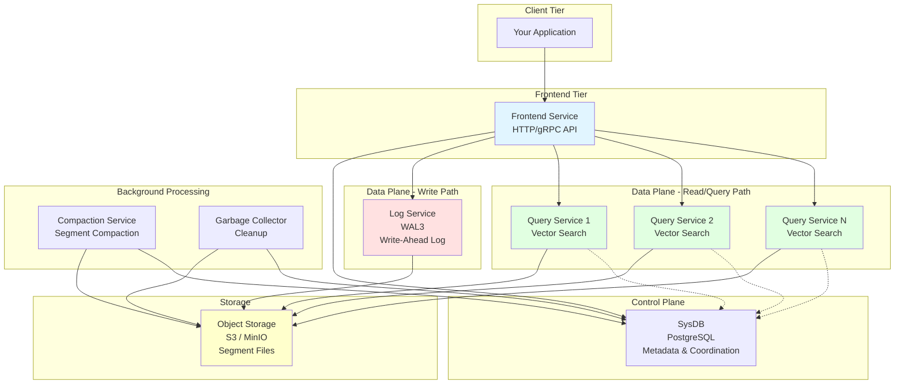
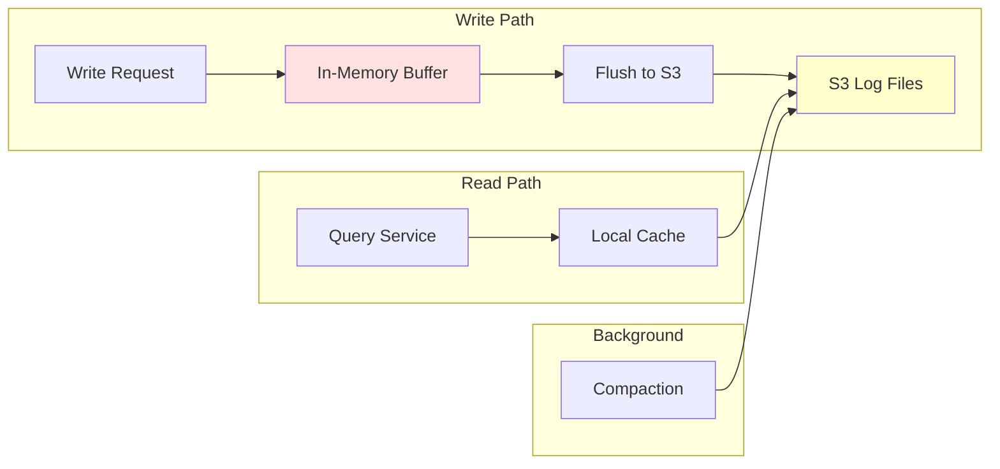
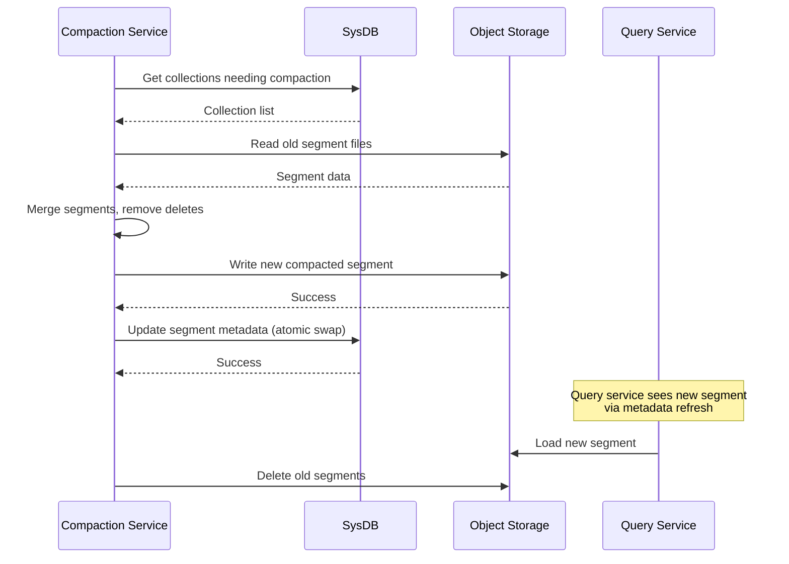

# Part 7: Distributed Architecture Deep Dive

## What You'll Learn

By the end of this post, you'll understand:
- Distributed Chroma's architecture and components
- How WAL3 (Write-Ahead Log v3) enables distributed writes
- gRPC-based inter-service communication
- Segment distribution and assignment strategies
- Consistency models and guarantees
- Scaling strategies for billion-vector deployments
- Operational complexity and trade-offs
- When distributed mode is worth the complexity

## Introduction: Scaling Beyond One Machine

Throughout this series, we've mostly discussed single-node Chroma. But what happens when you need to store billions of vectors, handle thousands of queries per second, or provide high availability? You need distributed Chroma.

Distributed systems are complex—they introduce coordination overhead, eventual consistency, and new failure modes. But they also enable horizontal scaling, fault tolerance, and geographic distribution. In this final post, we'll explore how Chroma distributes data and computation across multiple nodes.

## Distributed Architecture Overview

Distributed Chroma decomposes functionality into specialized services:



Let's examine each component.

## Component 1: Frontend Service

The frontend service is the entry point for all client requests.

**Responsibilities:**
- Expose HTTP/gRPC API
- Route requests to appropriate backend services
- Authentication and authorization
- Rate limiting and quota enforcement
- Request validation

**Implementation:**
```rust
// Simplified from rust/frontend/src/
// Frontend handles incoming requests and routes to services

async fn add_embeddings(
    collection_id: Uuid,
    embeddings: Vec<Embedding>,
) -> Result<(), Error> {
    // 1. Validate request
    validate_embeddings(&embeddings)?;

    // 2. Send to log service for persistence
    let log_client = LogServiceClient::new(log_service_address);
    let seq_ids = log_client
        .push_records(collection_id, embeddings)
        .await?;

    // 3. Return immediately (asynchronous indexing)
    Ok(())
}

async fn query(
    collection_id: Uuid,
    query_vectors: Vec<Vector>,
    k: usize,
) -> Result<QueryResults, Error> {
    // 1. Get collection metadata from SysDB
    let collection = sysdb_client
        .get_collection(collection_id)
        .await?;

    // 2. Determine which query service owns this collection's segments
    let query_service = segment_directory
        .get_query_service_for_collection(collection_id)
        .await?;

    // 3. Forward query to that service
    let results = query_service_client
        .query(query_vectors, k)
        .await?;

    Ok(results)
}
```

## Component 2: SysDB (System Database)

SysDB is the source of truth for metadata.

**Responsibilities:**
- Store collection, segment, and tenant metadata
- Track log positions and versions
- Coordinate segment assignments
- Manage configuration

**Why PostgreSQL?**

Unlike the local mode's SQLite, distributed mode uses PostgreSQL:
- **ACID transactions** across distributed components
- **Better concurrency** for multiple services
- **Replication** for high availability
- **Scalability** for large metadata sets

**Schema (simplified)**:
```sql
-- Collections table
CREATE TABLE collections (
    id UUID PRIMARY KEY,
    name VARCHAR NOT NULL,
    tenant VARCHAR NOT NULL,
    database VARCHAR NOT NULL,
    metadata JSONB,
    dimension INTEGER,
    log_position BIGINT,
    version INTEGER
);

-- Segments table
CREATE TABLE segments (
    id UUID PRIMARY KEY,
    collection_id UUID REFERENCES collections(id),
    type VARCHAR NOT NULL,  -- 'vector', 'metadata', 'record'
    scope VARCHAR NOT NULL,
    metadata JSONB,
    file_paths JSONB  -- Paths in object storage
);

-- Log positions
CREATE TABLE collection_log_positions (
    collection_id UUID PRIMARY KEY REFERENCES collections(id),
    log_position BIGINT NOT NULL
);
```

## Component 3: Log Service (WAL3)

The Log Service implements WAL3 (Write-Ahead Log, version 3), a distributed, durable, ordered log.

**Responsibilities:**
- Accept write requests
- Assign sequence IDs (ordering)
- Persist to object storage
- Serve reads to query services
- Handle compaction and cleanup

### WAL3 Architecture



**Key properties:**
- **Append-only**: Writes never modify existing data
- **Ordered**: Every record gets a monotonically increasing SeqID
- **Durable**: Flushed to S3 (replicated, durable storage)
- **Partitioned**: Per-collection logs for parallelism

**WAL3 Implementation Concepts:**

```rust
// Simplified from rust/wal3/
pub struct LogService {
    buffer: Arc<RwLock<HashMap<Uuid, Vec<LogRecord>>>>,
    s3_client: S3Client,
    flush_interval: Duration,
    max_buffer_size: usize,
}

impl LogService {
    pub async fn push_records(
        &self,
        collection_id: Uuid,
        records: Vec<OperationRecord>,
    ) -> Result<Vec<SeqId>, Error> {
        let mut buffer = self.buffer.write().await;
        let collection_buffer = buffer
            .entry(collection_id)
            .or_insert_with(Vec::new);

        let mut seq_ids = Vec::new();

        for record in records {
            let seq_id = self.next_seq_id(collection_id).await?;
            let log_record = LogRecord {
                seq_id,
                collection_id,
                operation: record.operation,
                embedding: record.embedding,
                metadata: record.metadata,
            };

            collection_buffer.push(log_record);
            seq_ids.push(seq_id);
        }

        // Flush if buffer is full
        if collection_buffer.len() >= self.max_buffer_size {
            self.flush(collection_id).await?;
        }

        Ok(seq_ids)
    }

    async fn flush(&self, collection_id: Uuid) -> Result<(), Error> {
        let records = {
            let mut buffer = self.buffer.write().await;
            buffer.remove(&collection_id).unwrap_or_default()
        };

        if records.is_empty() {
            return Ok(());
        }

        // Write to S3
        let file_name = format!(
            "{}/log-{}-{}.bin",
            collection_id,
            records.first().unwrap().seq_id,
            records.last().unwrap().seq_id
        );

        let data = serialize_records(&records)?;
        self.s3_client.put_object(&file_name, data).await?;

        Ok(())
    }
}
```

### WAL3 Guarantees

1. **Durability**: Once `push_records` returns, data is guaranteed to be in S3
2. **Ordering**: SeqIDs provide global ordering per collection
3. **At-least-once delivery**: Query services may see duplicates but not miss records
4. **Bounded latency**: Flush happens either on buffer full or timeout

## Component 4: Query Service

Query services handle vector search and retrieval.

**Responsibilities:**
- Subscribe to WAL for assigned collections
- Build and maintain HNSW indices
- Execute queries
- Cache segments locally

### Segment Assignment

How does the system decide which query service handles which collection?

**Rendezvous Hashing (Highest Random Weight)**:

```python
import hashlib

def get_query_service_for_collection(
    collection_id: str,
    query_services: List[str]
) -> str:
    """Deterministically assign collection to a query service.

    Uses rendezvous hashing for consistent assignment even as
    services join/leave.
    """
    def hash_score(collection_id: str, service: str) -> int:
        combined = f"{collection_id}:{service}"
        hash_bytes = hashlib.md5(combined.encode()).digest()
        return int.from_bytes(hash_bytes[:8], 'big')

    # Find service with highest hash score
    best_service = max(
        query_services,
        key=lambda svc: hash_score(collection_id, svc)
    )
    return best_service
```

**Why rendezvous hashing?**
- **Minimal reassignment**: When a node joins/leaves, only ~1/N collections move
- **Deterministic**: Any node can independently compute the same assignment
- **No coordination**: No need for a central coordinator

### Query Service Operation

```rust
// Simplified from rust/query-service/
pub struct QueryService {
    local_segments: Arc<RwLock<HashMap<Uuid, HnswSegment>>>,
    log_client: LogServiceClient,
    s3_client: S3Client,
    segment_cache: SegmentCache,
}

impl QueryService {
    pub async fn start(&self, my_assignments: Vec<Uuid>) {
        for collection_id in my_assignments {
            // Spawn a task to sync this collection
            let service = self.clone();
            tokio::spawn(async move {
                service.sync_collection(collection_id).await;
            });
        }
    }

    async fn sync_collection(&self, collection_id: Uuid) {
        // 1. Get current log position
        let current_position = self.get_local_log_position(collection_id);

        // 2. Subscribe to log starting from that position
        let mut log_stream = self.log_client
            .subscribe(collection_id, current_position)
            .await
            .unwrap();

        // 3. Process records as they arrive
        while let Some(records) = log_stream.next().await {
            self.apply_records(collection_id, records).await;
        }
    }

    async fn apply_records(
        &self,
        collection_id: Uuid,
        records: Vec<LogRecord>,
    ) {
        let mut segments = self.local_segments.write().await;
        let segment = segments
            .entry(collection_id)
            .or_insert_with(|| self.load_or_create_segment(collection_id));

        for record in records {
            match record.operation {
                Operation::Add => {
                    segment.add(record.embedding, record.id);
                }
                Operation::Update => {
                    segment.update(record.id, record.embedding);
                }
                Operation::Delete => {
                    segment.delete(record.id);
                }
            }
        }

        // Update local log position
        self.update_log_position(collection_id, records.last().unwrap().seq_id);
    }

    pub async fn query(
        &self,
        collection_id: Uuid,
        query_vectors: Vec<Vector>,
        k: usize,
    ) -> Result<Vec<Vec<QueryResult>>, Error> {
        let segments = self.local_segments.read().await;
        let segment = segments
            .get(&collection_id)
            .ok_or(Error::CollectionNotFound)?;

        // Execute HNSW search
        let results = segment.query(query_vectors, k)?;
        Ok(results)
    }
}
```

## Component 5: Compaction Service

Over time, segments accumulate many small log files and deleted records. The compaction service consolidates them.

**Responsibilities:**
- Merge small segment files into larger ones
- Remove deleted records
- Optimize HNSW index
- Reduce storage costs and improve query performance

**Compaction Process:**



**When to compact:**
- Many small log files (>100 files per collection)
- High delete ratio (>20% records deleted)
- Query performance degradation
- Scheduled (e.g., nightly)

## Consistency Model

Distributed Chroma provides **eventual consistency** with strong ordering guarantees:

### Write Consistency

**Guarantee**: Once a write is acknowledged, it is durable in the log.

**Ordering**: Writes to the same collection are ordered by SeqID.

**Visibility**: Writes become visible to queries after:
1. Log service flushes to S3
2. Query service reads from log
3. Query service applies to local index

**Typical latency**: 100ms - 2 seconds from write to query visibility.

### Read Consistency

**Guarantee**: Queries see a consistent snapshot at a specific log position.

**Freshness**: Queries may not see the very latest writes (eventual consistency).

**Stale reads**: Possible if query service is behind on log processing.

### Strong Consistency (Optional)

For applications requiring read-your-writes:

```python
# Write and get SeqID
result = collection.add(
    documents=["Important document"],
    ids=["doc1"]
)
# In distributed mode, this returns the SeqID

# Query with minimum log position
results = collection.query(
    query_texts=["Important"],
    n_results=10,
    # Hypothetical API:
    min_log_position=result.seq_id  # Wait for this position
)
# Query service waits until it has processed up to this SeqID
```

## Scaling Strategies

### Vertical Scaling (Single Service)

**Query Service**: Scale up for:
- More collections
- Larger collections
- More concurrent queries

**Limits**:
- Memory (HNSW indices in RAM)
- File descriptors (one index per collection)
- CPU (query processing)

**Typical limits**: ~10,000 collections, ~100M vectors per service

### Horizontal Scaling (Multiple Services)

**Add more query services** when:
- Total collections exceed one service's capacity
- Query load exceeds one service's throughput
- Need geographic distribution

**Process**:
1. Add new query service pod
2. Memberlist detects new member
3. Rendezvous hash reassigns ~1/N collections to new service
4. Reassigned collections sync from log
5. Old service evicts reassigned collections

### Partitioning Large Collections

For collections exceeding single-service capacity:

**Strategy 1: Metadata-based partitioning**
```python
# Partition by date
collection_2024_q1 = client.get_collection("docs_2024_q1")
collection_2024_q2 = client.get_collection("docs_2024_q2")

# Query strategy: fan-out and merge
results = []
for collection in [collection_2024_q1, collection_2024_q2]:
    results.extend(collection.query(query, n_results=10))
results.sort(key=lambda x: x.distance)
```

**Strategy 2: Segment-level distribution** (future):
- Split collection into multiple vector segments
- Distribute segments across query services
- Frontend service fans out query to all relevant services
- Merge and re-rank results

## gRPC Communication

Services communicate via gRPC for efficiency:

**Benefits**:
- **Protocol Buffers**: Efficient binary serialization
- **Streaming**: Bidirectional streaming for log subscription
- **HTTP/2**: Multiplexing, header compression
- **Type safety**: Strongly typed service definitions

**Example service definition**:
```protobuf
service LogService {
    rpc PushRecords(PushRecordsRequest) returns (PushRecordsResponse);
    rpc SubscribeToLog(SubscribeRequest) returns (stream LogRecord);
}

message PushRecordsRequest {
    string collection_id = 1;
    repeated OperationRecord records = 2;
}

message PushRecordsResponse {
    repeated uint64 seq_ids = 1;
}
```

## Operational Complexity

Distributed mode introduces significant complexity:

### Benefits
- ✅ Horizontal scalability (billions of vectors)
- ✅ High availability (replicate query services)
- ✅ Isolated failures (one collection failure doesn't affect others)
- ✅ Geographic distribution

### Costs
- ❌ More components to deploy and monitor
- ❌ Eventual consistency (not read-your-writes)
- ❌ Network latency overhead
- ❌ Coordination complexity (segment assignment, compaction)
- ❌ Higher infrastructure costs

### When to Use Distributed Mode

**Use distributed mode when:**
- Collections exceed single-node capacity (>100M vectors)
- Query load exceeds single-node throughput (>1000 QPS)
- High availability is critical (99.9%+ uptime)
- Geographic distribution needed

**Stick with server mode when:**
- Total data fits on one machine (<100M vectors)
- Moderate query load (<1000 QPS)
- Simplicity is important
- Strong consistency required

## Kubernetes Deployment (Distributed Mode)

Deploying distributed Chroma on Kubernetes:

```yaml
# From k8s/distributed-chroma/values.yaml
# https://github.com/chroma-core/chroma/blob/091f8bd5c553f8267c48664e98fb32215055f58e/k8s/distributed-chroma/values.yaml

# Frontend service
rustFrontendService:
  replicaCount: 2  # For HA
  resources:
    limits:
      cpu: '2000m'
      memory: '1Gi'

# Log service (WAL3)
rustLogService:
  replicaCount: 1  # Can scale horizontally
  cache:
    hostPath: '/local/cache/chroma-log-service'

# Query services
queryService:
  replicaCount: 3  # Scale based on load
  cache:
    hostPath: '/local/cache/chroma-query-service'

# System database
sysdb:
  replicaCount: 1  # PostgreSQL (use external managed DB in production)

# Compaction service
compactionService:
  replicaCount: 1

# Garbage collector
garbageCollector:
  replicaCount: 1
```

**Deploy with Helm:**
```bash
helm install chroma ./k8s/distributed-chroma \
  --set sysdb.host=postgres.example.com \
  --set s3.bucket=chroma-storage \
  --set s3.region=us-west-2
```

## Key Takeaways

1. **Distributed Chroma decomposes into specialized services** - frontend, log, query, compaction, GC

2. **WAL3 provides ordered, durable writes** - append-only log in S3 with SeqID ordering

3. **Rendezvous hashing assigns collections to query services** - deterministic, minimal reassignment

4. **Query services are stateful** - cache segments locally, subscribe to WAL for updates

5. **Eventual consistency is the default** - writes visible within ~100ms-2s

6. **Compaction service maintains performance** - merges segments, removes deletes

7. **gRPC enables efficient communication** - binary protocol, streaming, type safety

8. **Operational complexity is significant** - more components, coordination, monitoring

9. **Horizontal scaling enables billion-vector deployments** - add query services as needed

10. **Use distributed mode only when necessary** - server mode suffices for many use cases

## Final Thoughts: Choosing Your Path

We've completed our journey through Chroma's architecture, from embedded mode to distributed deployment. Here's how to choose:

**Start simple:**
- Development: `EphemeralClient` or `PersistentClient`
- Production (small): Docker Compose with server mode
- Production (large): Kubernetes with server mode

**Scale when needed:**
- Monitor capacity and performance
- Vertical scale first (bigger machines)
- Horizontal scale when vertical limit reached
- Distributed mode for >100M vectors or high availability

**Remember:**
- Complexity is a cost
- Simpler architectures are easier to operate
- Scale when you need to, not before

## Series Conclusion

Congratulations on completing this technical deep dive into Chroma! We've covered:

1. **Architecture** - Layered design with segment abstraction
2. **Vector storage** - HNSW indexing and performance
3. **Patterns** - DI, Strategy, expression algebra, testing
4. **Extension** - Custom embedding functions, integrations
5. **Performance** - Bottlenecks, optimization, benchmarking
6. **Operations** - Deployment, monitoring, security
7. **Distribution** - Scaling to billions of vectors

You now have the knowledge to:
- Understand Chroma's design decisions and trade-offs
- Extend Chroma for custom use cases
- Optimize for your specific workload
- Deploy and operate Chroma in production
- Scale from laptop to data center

**Where to go from here:**

- **Contribute**: The codebase is open source—submit PRs, fix bugs, add features
- **Experiment**: Build something, break things, learn by doing
- **Share**: Write about your experiences, help others learn
- **Connect**: Join the Chroma community, ask questions, share insights

Thank you for joining me on this exploration of Chroma's internals. May your vectors be well-embedded and your queries be fast!

---

**[← Part 6: Deployment and Operations](06-deployment-operations.md)** | **[Series Outline](00-series-outline.md)**

---

*Code examples from Chroma commit [`091f8bd`](https://github.com/chroma-core/chroma/tree/091f8bd5c553f8267c48664e98fb32215055f58e)*

*End of Series*
